# Assignment I - Discrete Math(H)

**Name**: Yuxuan HOU (侯宇轩)

**Student ID**: 12413104

**Date**: 2025.10.12

## Q.1

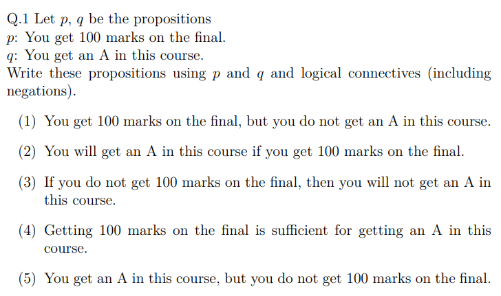

Sol:

1. $p \land \lnot q$.
1. $p \to q$.
1. $\lnot p \to \lnot q$.
1. $p \to q$.
1. $q \land \lnot p$.

## Q.2

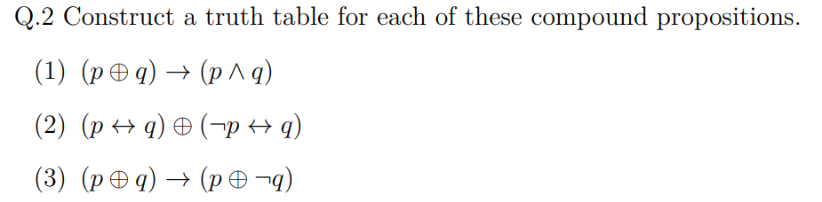

Sol:

1. $(p\oplus q)\to(p\land q)$

| $p$  | $q$  | $p\oplus q$ | $p\land q$ | $(p\oplus q)\to(p\land q)$ |
| :--: | :--: | :---------: | :--------: | :------------------------: |
|  F   |  F   |      F      |     F      |             T              |
|  F   |  T   |      T      |     F      |             F              |
|  T   |  F   |      T      |     F      |             F              |
|  T   |  T   |      F      |     T      |             T              |

2.  $(p\leftrightarrow q)\ \oplus\ (\lnot p\leftrightarrow q)$

| $p$  | $q$  | $p\leftrightarrow q$ | $\lnot p\leftrightarrow q$ | $(p\leftrightarrow q)\ \oplus\ (\lnot p\leftrightarrow q)$ |
| :--: | :--: | :------------------: | :------------------------: | :--------------------------------------------------------: |
|  F   |  F   |          T           |             F              |                             T                              |
|  F   |  T   |          F           |             T              |                             T                              |
|  T   |  F   |          F           |             T              |                             T                              |
|  T   |  T   |          T           |             F              |                             T                              |

3. $(p\oplus q)\to(p\oplus \lnot q)$

| $p$  | $q$  | $p\oplus q$ | $p\oplus \lnot q$ | $(p\oplus q)\to(p\oplus \lnot q)$ |
| :--: | :--: | :---------: | :---------------: | :-------------------------------: |
|  F   |  F   |      F      |         T         |                 T                 |
|  F   |  T   |      T      |         F         |                 F                 |
|  T   |  F   |      T      |         F         |                 F                 |
|  T   |  T   |      F      |         T         |                 T                 |

## Q.3

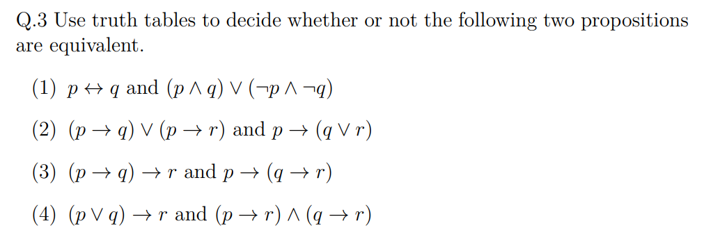

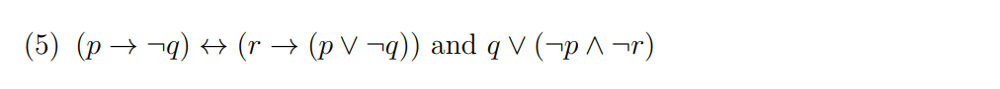

Sol:

1. 

| $p$  | $q$  | $p\leftrightarrow q$ | $(p\land q)\lor(\lnot p\land\lnot q)$ | Equivalent |
| :--: | :--: | :------------------: | :-----------------------------------: | :--------: |
|  F   |  F   |          T           |                   T                   |     T      |
|  F   |  T   |          F           |                   F                   |     T      |
|  T   |  F   |          F           |                   F                   |     T      |
|  T   |  T   |          T           |                   T                   |     T      |

Thus it's **Equivalent**.

------

2. 

| $p$  | $q$  | $r$  | $(p\to q)\lor(p\to r)$ | $p\to(q\lor r)$ | Equivalent |
| :--: | :--: | :--: | :--------------------: | :-------------: | :--------: |
|  F   |  F   |  F   |           T            |        T        |     T      |
|  F   |  F   |  T   |           T            |        T        |     T      |
|  F   |  T   |  F   |           T            |        T        |     T      |
|  F   |  T   |  T   |           T            |        T        |     T      |
|  T   |  F   |  F   |           F            |        F        |     T      |
|  T   |  F   |  T   |           T            |        T        |     T      |
|  T   |  T   |  F   |           T            |        T        |     T      |
|  T   |  T   |  T   |           T            |        T        |     T      |

Thus it's **Equivalent**.

------

3. 

| $p$  | $q$  | $r$  | $(p\to q)\to r$ | $p\to(q\to r)$ | Equivalent |
| :--: | :--: | :--: | :-------------: | :------------: | :--------: |
|  F   |  F   |  F   |        F        |       T        |     F      |
|  F   |  F   |  T   |        T        |       T        |     T      |
|  F   |  T   |  F   |        F        |       T        |     F      |
|  F   |  T   |  T   |        T        |       T        |     T      |
|  T   |  F   |  F   |        T        |       T        |     T      |
|  T   |  F   |  T   |        T        |       T        |     T      |
|  T   |  T   |  F   |        F        |       F        |     T      |
|  T   |  T   |  T   |        T        |       T        |     T      |

Thus it's **Not Equivalent**.

---

4. 

| $p$  | $q$  | $r$  | $(p\lor q)\to r$ | $(p\to r)\land(q\to r)$ | Equivalent |
| :--: | :--: | :--: | :--------------: | :---------------------: | :--------: |
|  F   |  F   |  F   |        T         |            T            |     T      |
|  F   |  F   |  T   |        T         |            T            |     T      |
|  F   |  T   |  F   |        F         |            F            |     T      |
|  F   |  T   |  T   |        T         |            T            |     T      |
|  T   |  F   |  F   |        F         |            F            |     T      |
|  T   |  F   |  T   |        T         |            T            |     T      |
|  T   |  T   |  F   |        F         |            F            |     T      |
|  T   |  T   |  T   |        T         |            T            |     T      |

Thus it's **Equivalent**.

---

5. 

| $p$  | $q$  | $r$  | $(p\to \lnot q)\leftrightarrow(r\to(p\lor\lnot q))$ | $q\lor(\lnot p\land \lnot r)$ | Equivalent |
| :--: | :--: | :--: | :-------------------------------------------------: | :---------------------------: | :--------: |
|  F   |  F   |  F   |                          T                          |               T               |     T      |
|  F   |  F   |  T   |                          T                          |               F               |     F      |
|  F   |  T   |  F   |                          T                          |               T               |     T      |
|  F   |  T   |  T   |                          F                          |               T               |     F      |
|  T   |  F   |  F   |                          T                          |               F               |     F      |
|  T   |  F   |  T   |                          T                          |               F               |     F      |
|  T   |  T   |  F   |                          F                          |               T               |     F      |
|  T   |  T   |  T   |                          F                          |               T               |     F      |

Thus it's **Not Equivalent**.

## Q.4

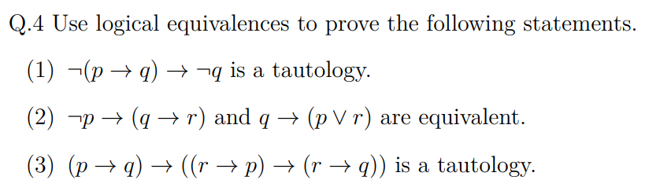

PF:

1. 

$$
\begin{aligned}
        \lnot(p\to q)\to \lnot q
        &\equiv \lnot(\lnot p\lor q)\to \lnot q \\
        &\equiv (p\land \lnot q)\to \lnot q \\
        &\equiv \lnot(p\land \lnot q)\lor \lnot q \\
        &\equiv (\lnot p\lor q)\lor \lnot q \\
        &\equiv \top
\end{aligned}
$$

$\texttt{Q.E.D.}$.

2. 

$$
\begin{aligned}
 \lnot p\to(q\to r)
 &\equiv p\lor(\lnot q\lor r)\\
 &\equiv \lnot q\lor(p\lor r)\\
 &\equiv q\to(p\lor r)
 \end{aligned}
$$

$\texttt{Q.E.D.}$.

3. 

$$
\begin{aligned}
 (r\to p)\to(r\to q)
 &\equiv \lnot(\lnot r\lor p)\lor(\lnot r\lor q)\\
 &\equiv (r\land \lnot p)\lor \lnot r\lor q\\
 &\equiv \lnot p\lor \lnot r\lor q.
 \end{aligned}
$$

Then:
$$
\begin{aligned}
 (p\to q)\to((r\to p)\to(r\to q))
 &\equiv (p\to q)\to(\lnot p\lor \lnot r\lor q) \\
 &\equiv \lnot(\lnot p\lor q)\lor(\lnot p\lor \lnot r\lor q)\\
 &\equiv \top
 \end{aligned}
$$
$\texttt{Q.E.D.}$.

## Q.5

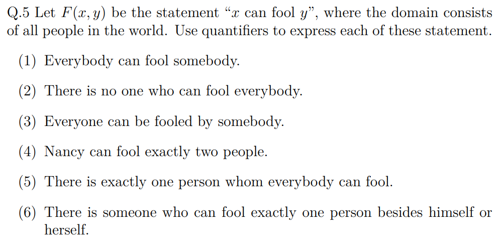

Sol:

1. $\forall x,\exists y,F(x,y)$.

2. $\forall x,\exists y,\lnot F(x,y)$.
3. $\forall y,\exists x,F(x,y)$.
4. $\exists x\exists y,[x\neq y\land F(Nancy, x)\land F(Nancy, y)\land \forall u(F(Nancy, u) \to (u=x\lor u=y))]$.
5. $\exists u,[\forall x,F(x,u)\land \forall v(\forall x,F(x,v)\to v=u)]$.
6. $\exists x\exists y,[y\neq x\land F(x,y) \land  \lnot F(x,x) \land \forall z(F(x,z)\to z=y)]$.

## Q.6

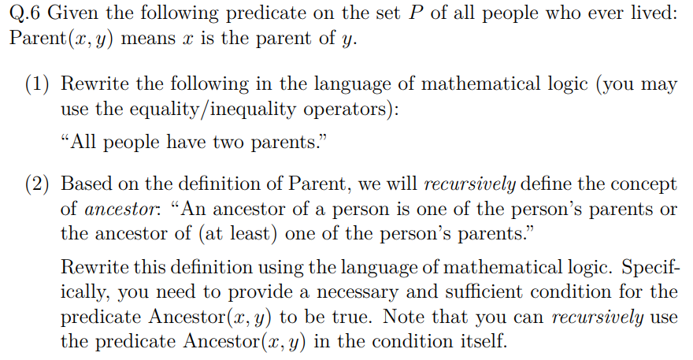

Sol:

1. (if it represent 'exactly 2')

$$
\forall x,\exists y\exists z,[y\neq z\land Parent(y,x)\land Parent(z,x)\land
\forall w(Parent(w,x)\to(w=y\lor w=z))]
$$

2. 

$$
\forall x\forall y,[Ancestor(x,y)\ \leftrightarrow\ (Parent(x,y) \lor \exists z(Parent(z,y)\land Ancestor(x,z)))].
$$

## Q.7

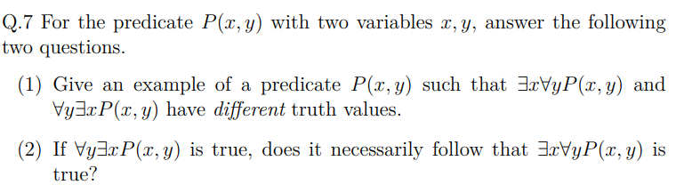

Sol:

1. Take the domain $\mathbb{N}$, and let $P(x, y): x > y$, obviously $\exists x \forall y P(x, y)$ is false (we can trivally find some y that violates $P(x, y)$ forall $x$), but $ \forall y\exists x P(x, y)$ is true, for we can let $x = y + 1$.
2. Not necessary. Same as the example in (1), it's not necessary.

## Q.8

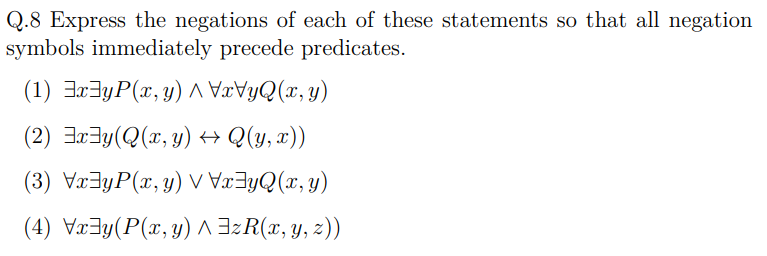

Sol:

1. 

$$
\begin{aligned}
 &\lnot[\exists x\exists y,P(x,y)\land \forall x\forall y,Q(x,y)]\\
  \equiv& \ \lnot\exists x\exists y,P(x,y)\ \lor\ \lnot\forall x\forall y,Q(x,y) \\
 \equiv& \ \forall x\forall y,\lnot P(x,y)\ \lor\ \exists x\exists y,\lnot Q(x,y)

 \end{aligned}
$$

2. 

$$
\begin{aligned}
 &\lnot\exists x\exists y(Q(x,y)\leftrightarrow Q(y,x))\\
 \equiv& \ \forall x\forall y,\lnot(Q(x,y)\leftrightarrow Q(y,x)) \\
 \equiv& \ \forall x\forall y,\big[(Q(x,y)\land \lnot Q(y,x))\ \lor\ (\lnot Q(x,y)\land Q(y,x))\big]

 \end{aligned}
$$

3. 

$$
\begin{aligned}
 &\lnot[\forall x\exists y,P(x,y)\ \lor\ \forall x\exists y,Q(x,y)]\\
\equiv&\ \lnot\forall x\exists y,P(x,y)\ \land\ \lnot\forall x\exists y,Q(x,y) \\
 \equiv&\ \exists x\forall y,\lnot P(x,y)\ \land\ \exists x\forall y,\lnot Q(x,y)\\
 \end{aligned}
$$

4. 

$$
\begin{aligned}
 &\lnot\forall x\exists y,[P(x,y)\land \exists zR(x,y,z)]\\
 \equiv&\ \exists x\forall y,[\lnot P(x,y)\lor\forall z,\lnot R(x,y,z)]\\

 \end{aligned}
$$

## Q.9

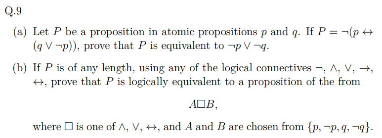

PF:

1. 

$$
\begin{aligned}
 P &\equiv \lnot[(p\land(q\lor\lnot p)) \lor (\lnot p\land \lnot(q\lor\lnot p))]\\
 &\equiv (\lnot p \lor\lnot(q\lor\lnot p)) \land (p \lor q \lor \lnot p)\\
 &\equiv (\lnot p \lor(\lnot q\land p))\\
 &\equiv \lnot p\lor\lnot q.

 \end{aligned}
$$

$\texttt{Q.E.D.}$.

2. 

We have a truth table like:

|  p   |  q   |    P    |
| :--: | :--: | :-----: |
|  0   |  0   | $p_{1}$ |
|  0   |  1   | $p_{2}$ |
|  1   |  0   | $p_{3}$ |
|  1   |  1   | $p_{4}$ |

- When $p_1 = p_2 = p_3 = p_4 = 0$, we have $p\leftrightarrow p$.
- When $p_1 = p_2 = p_3 = p_4 = 1$, we have $p \land \lnot p$.
- When there exists exactly one $p = 1$, we can use $\land$ to express.
- When there exists exactly three $p = 1$, we can use $\lor$ to express.
- When $p_1 = p_2 = 1, p_3 = p_4 = 0$, we have $\lnot p \land \lnot p$.
- When $p_1 = p_2 = 0, p_3 = p_4 = 1$, we have $p \land p$.
- When $p_1 = p_3 = 1, p_2 = p_4 = 0$, we have $\lnot q \land \lnot q$.
- When $p_1 = p_3 = 0, p_2 = p_4 = 1$, we have $q \land q$.
- When $p_1 = p_4 = 0, p_2 = p_3 = 1$, we have $p \oplus q \equiv \lnot p \leftrightarrow q$.
- When $p_1 = p_4 = 1, p_2 = p_3 = 0$, we have $p \leftrightarrow q$.

$\texttt{Q.E.D.}$.

## Q.10

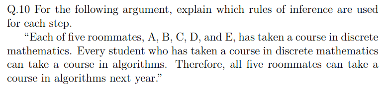

Sol:

Let $D(x)$ denotes $x$ has taken discrete math, and $A(x)$ denotes $x$ can take algorithms next year.

We have: $D(A)\land D(B)\land D(C)\land D(D)\land D(E)$.

Also we have $\forall x(D(x)\to A(x))$.

Implement **UI(Universal Instantiation)** to A, B, C, D, E, then we have: $D(A), D(B), D(C), D(D), D(E)$.

Implement **Modus Ponens**, then we have: $A(A),A(B),A(C),A(D),A(E)$.

Implement $\lor_i$**(Conjunction Introduction)**, then we have: $A(A)\land A(B)\land A(C)\land A(D)\land A(E)$.

## Q.11

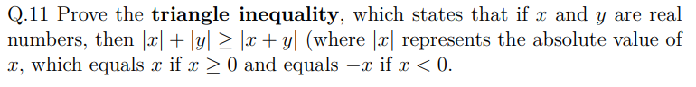

PF:
$$
\begin{aligned}
 (\texttt{LHS})^2 - (\texttt{RHS})^2&= (|x|+|y|)^2-(|x+y|)^2\\
 &= x^2+y^2+2|x||y|-(x+y)^2\\
 &= 2(|x||y|-xy)\\
& \ge 0
 \end{aligned}
$$
Thus $\texttt{LHS} \ge \texttt{RHS}$.

$\texttt{Q.E.D.}$.

## Q.12

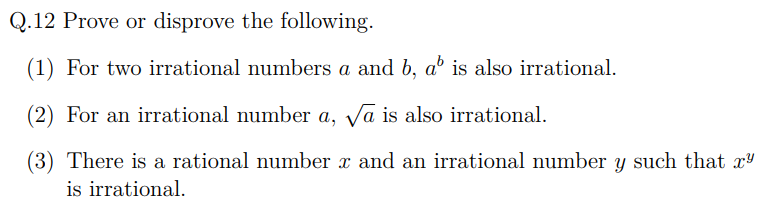

PF:

1. If $\sqrt{2}^\sqrt{2}$ is irrational, let $a = \sqrt{2}^\sqrt{2}, b = \sqrt{2}$, then $a^b = \sqrt{2}^2 = 2$, which is rational.

   If  $\sqrt{2}^\sqrt{2}$ is rational, W.L.O.G., let $a^b = \sqrt{2}^\sqrt{2}$, where $\sqrt{2}$ is irrational, i.e., $a, b$ is irrational.

   Therefore the statement is false.

   $\texttt{Q.E.D.}$.

2. The contrapositive of the statement is if $\sqrt{a}$ is rational, then $a$ is rational.

   Let $\sqrt{a} = \dfrac{m}{n}$, then $a = \dfrac{m^2}{n^2} \in \mathbb{Q}$.

   For the contrapositive is true, the original statement is true.

   $\texttt{Q.E.D.}$.

3. Let $x = 10, y = \log_{10}^\pi$, then $x^y = \pi$, which is irrational.

   And $x$ is obvoiusly rational, for $y = \log_{10}^\pi$. Assuming $y$ is rational, let $\log_{10}^\pi = \dfrac{a}{b}$, then $10^a = \pi^b$. Since $\pi$ is a transcendental, every power of it is irrational, which leads to a controdiction. Thus $y$ is irrational.

   Therefore, $x$ is rational, $y$ is irrational, $x^y$ is irrational.

   $\texttt{Q.E.D.}$.
## Q.13

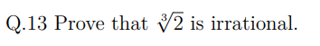

PF: Assuming $\sqrt[3]{2}$ is rational, let $\sqrt[3]{2}=\dfrac{m}{n}$, where $m, n$ are coprime. Then $2n^3 = m^3$, and $2 \mid m^3 \Rightarrow 2 \mid m$. Thus let $m = 2k$, then $n^3 = 4k^3 \Rightarrow 2 \mid n^3 \Rightarrow 2 \mid n$, leading to a contradiction. Therefore, $\sqrt[3]{2}$ is irrational.

$\texttt{Q.E.D.}$.

## Q.14

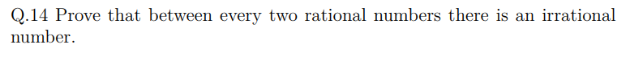

PF:

Let $p < q$ ans $p, q$ are irrational.

Thus, let $r = p + \dfrac{q - p}{\sqrt{2}}$, obviously $p < r < q$. And since $p, q$ are rational, assuming $r$ is rational, then $r - p = \dfrac{q - p}{\sqrt{2}}$ is rational, then $\sqrt{2} = \dfrac{q - p}{r - p}$ is rational, which leads to a contradiction. Therefore $r$ is irrational.

$\texttt{Q.E.D.}$.

## Q.15

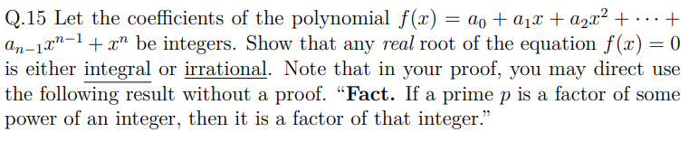

PF: Let the root $x = \dfrac{a}{b}$, where $a, b$ are coprime, w.l.o.g., let $b > 0$.

Substitude and multiply by $b^n$, we have:
$$
a^n + a_{n-1}a^{n-1}b+\cdots + a_0 b^n = 0
$$
 Then:
$$
a^n = -b(a_{n - 1}a^{n - 1} + \cdots + a_0b^{n - 1})
$$
Thus, $b \mid a^n$. Then $b \mid a$ for the Fact noticed in the question, which leads to a contradiction.

Therefore, $x = \dfrac{a / b}{1}$ which is an integer or $x$ couldn't be represented as fraction, which is irrational.

$\texttt{Q.E.D.}$.