# Assignment II - Discrete Math(H)

**Name**: Yuxuan HOU (侯宇轩)

**Student ID**: 12413104

**Date**: 2025.10.26

## Q.1

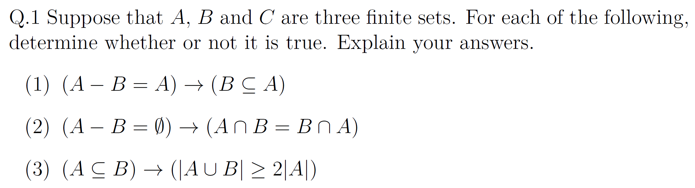

Sol:

1. **False**.

We have $A-B=\{x\mid x\in A\land x\notin B\}=A\cap \overline{B}$, thus $A\cap \overline{B} = A$, which is to say, $A\cap B=\varnothing$, thus $B\subseteq A$ obviously can't be implied.

2. **True**.

Intersection is commutative, thus $A\cap B=B\cap A$ is always true, thus the implication is always true.

3. **False**.

If $A\subseteq B$, then $A\cup B=B$, thus $\abs{A} \le \abs{B}$, and $\abs{A} \le \abs{A\cup B}$. But for $\abs{A\cup B} \ge 2\abs{A}$, it's obviously not generally true. Counterexample: $A = B = \{1\}$.

## Q.2

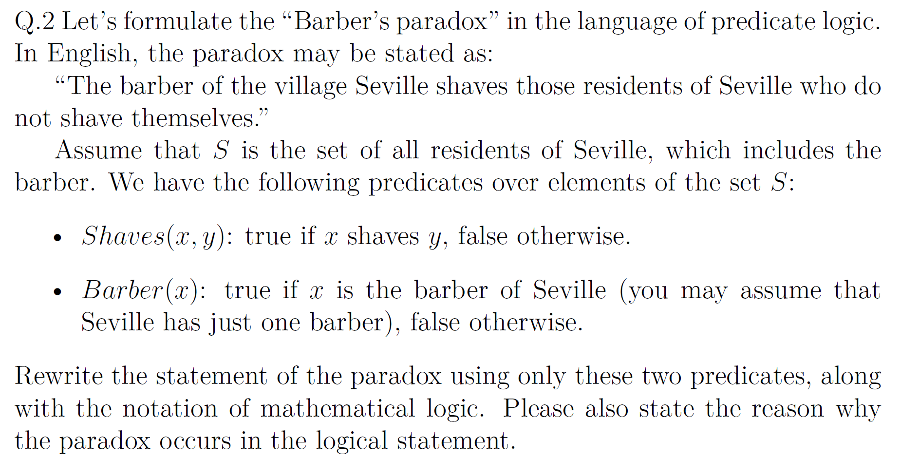

Sol:
$$
\exists b \ \Big( \text{Barber}(b)\land\forall y,\text{Shaves}(b,y)\ \leftrightarrow\ \neg \text{Shaves}(y,y)\Big)
$$
Substitute that $y = b$, we have $\text{Shaves}(b,b)\ \leftrightarrow\ \neg \text{Shaves}(b,b)$ which is false. Thus the statement will always lead to a contradiction, which is a paradox.

## Q.3

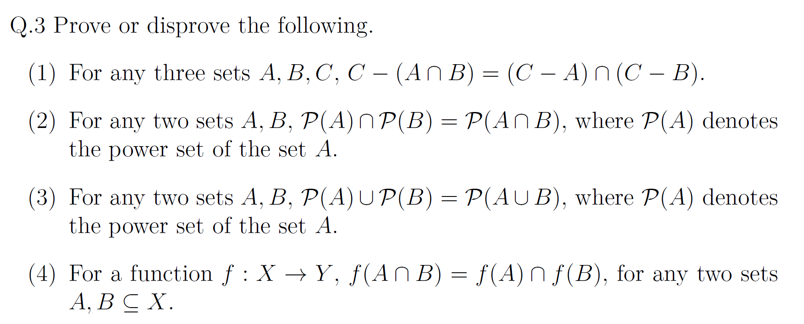

1. **False**.

$$
\texttt{LHS} = C \cap \overline{A \cap B} = C \cap (\overline{A} \cup \overline{B}) = (C - A)\cup (C - B) \neq \texttt{RHS}
$$

2. **True**.

Let $a \in \mathcal P(A)\cap\mathcal P(B)$, then $a \subseteq A$ and $a \subseteq B$, thus $a \subseteq A \cap B $, which represents $a \in \mathcal P(A \cap B)$.

Let $a \in P(A \cap B)$, then $a \subseteq A \cap B $, thus $a \subseteq A$ and $a \subseteq B$, which represents $a \in \mathcal P(A)\cap\mathcal P(B)$.

3. **False**.

Some subsets of $A\cup B$ conrain elements from both $A$ and $B$, which is not belong to any of $\mathcal P(A)$ or $\mathcal P(B)$. Which leads it to be false.

4. **False**.

If $y\in f(A\cap B)$, there exists $x\in A\cap B$ s.t. $f(x)=y$. Hence $y\in f(A)$ and $y\in f(B)$, which is $y \in f(A) \cap f(B)$.

But if $y\in f(A)\cap f(B)$, then when $\exists a\in A, \exists b\in B, y=f(a)=f(b)$, and when $a \not\in B$ and $b \not\in A$, then there's no $a, b \in A \cap B$, which represent $y \not\in f(A \cap B)$.

## Q.4

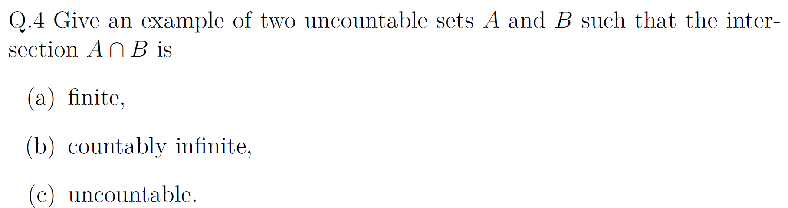

Sol:

1. $A = [0, 1]$, $B = [1, 2]$, then $A \cap B = \{1\}$, which is finite.
2. $A = [0, 1] \cup \mathbb{Z}$, $B = [2, 3] \cup \mathbb{Z}$, then $A \cap B = \mathbb{Z}$, which is countably infinite.
3. $A = [0, 2]$, $B = [1, 3] $, then $A \cap B = [1, 2]$, which is uncountable.

## Q.5

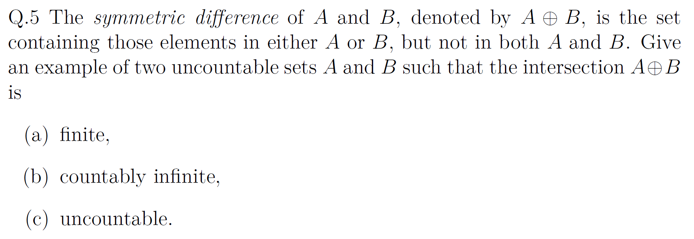

Sol:

1. $A = [0, 1]$, $B = [0, 1] \cup \{2\}$, then $A \oplus B = \{2\}$, which is finite.
2. $A = [-2, -1]$, $B = [-2, -1] \cup \mathbb{N}$, then $A \oplus B = \mathbb{N}$, which is countably infinite.
3. $A = [0, 1]$, $B = [2, 3]$, then $A \oplus B = [0, 1] \cup [2, 3]$, which is uncountable.

## Q.6

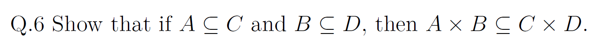

PF:
We have $\forall (a,b)\in A \times B, \ a\in A \land b\in B$.

And for $A\subseteq C, B\subseteq D$, we obtain $a\in C, b\in D$, which is $(a, b) \in C \times D$.

Therefore, $A\times B\subseteq C\times D$.

$\texttt{Q.E.D.}$.

## Q.7

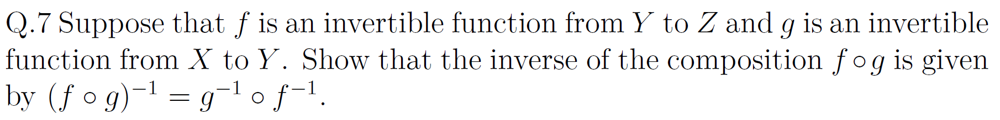

PF:

We have:
$$
(f\circ g)\circ(g^{-1}\circ f^{-1})
 = f\circ (g\circ g^{-1})\circ f^{-1}
 = f\circ I_Y\circ f^{-1}
 = I_Z
$$
and:
$$

 (g^{-1}\circ f^{-1})\circ(f\circ g)
 = g^{-1}\circ (f^{-1}\circ f)\circ g
 = g^{-1}\circ I_Y \circ g
 = g^{-1}\circ g
 = I_X.
 
$$
Thus $(f\circ g)^{-1} = g^{-1}\circ f^{-1}$.

$\texttt{Q.E.D.}$.

## Q.8

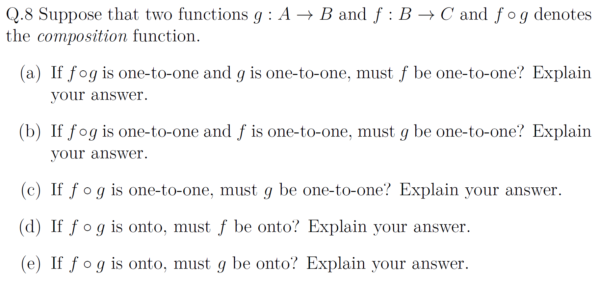

Sol:

1. $f$ doesn't have to be one-to-one.

Let $A=\{1,2\}$, $B=\{a,b,c\}$, $C=\{0,1\}$, and $g(1)=a, g(2)=b, f(a)=0,f(b)=1,f(c)=1$, then $(f\circ g)(1)=0,(f\circ g)(2)=1$, which is an injection.

2. $g$ must be one-to-one.

If $\exists x_1, x_2, s.t. x_1 \neq x_2 \land g(x_1) = g(x_2)$, then $(f\circ g)(x_1)=(f\circ g)(x_2)$, leads to a contradiction. Thus $g$ is an injection.

3. $g$ must be one-to-one.

Reason is same as 2.

4. $f$ must be onto.

We have $\forall z \in C, \exists x \in A, (f\circ g)(x)=z$, let $y = g(x)$, then $f(y) = z$, i.e., $f$ is a surjection.

5. $g$ doesn't have to be onto.

Let $A=\{a,b\}$, $B=\{0,1,2\}$, $C=\{0,1\}$, $g(a)=0,g(b)=1, f(0)=0,f(1)=1,f(2)=1$, then $(f\circ g)(a)=0,(f\circ g)(b)=1$, which is a surjection.

## Q.9

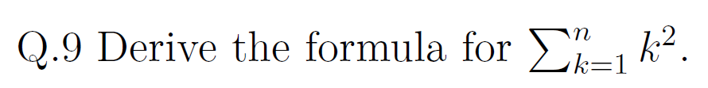

Sol:
$$
\begin{aligned}
k^3-(k-1)^3&=3k^2-3k+1\\
\Rightarrow\sum_{k=1}^n\big(k^3-(k-1)^3\big) &= \sum_{k=1}^n(3k^2-3k+1) \\
\Rightarrow n^3 &= 3\sum_{k=1}^n k^2-3\sum_{k=1}^n k+n \\
\Rightarrow 3\sum_{k=1}^n k^2&=n^3+3\cdot\frac{n(n+1)}{2}-n \\
\Rightarrow \sum_{k=1}^n k^2&=\frac{1}{3}(n^3-n)+\frac{n(n+1)}{2}\\
\Rightarrow \sum_{k=1}^n k^2&=\frac{n(n+1)(2n+1)}{6}
\end{aligned}
$$

## Q.10

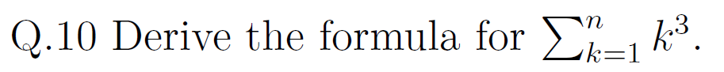

Sol:
$$
\begin{aligned}
k^4-(k-1)^4&=4k^3-6k^2+4k-1\\
\Rightarrow\sum_{k=1}^n\big(k^4-(k-1)^4\big) &= \sum_{k=1}^n(4k^3-6k^2+4k-1) \\
\Rightarrow n^4 &= 4\sum_{k=1}^n k^3-6\sum_{k=1}^n k^2+4\sum_{k=1}^n k-n \\
\Rightarrow 4\sum_{k=1}^n k^3&=n^4+n(n+1)(2n+1)-2n(n+1)+n \\
\Rightarrow \sum_{k=1}^n k^3&=\left(\frac{n(n+1)}{2}\right)^2
\end{aligned}
$$

## Q.11

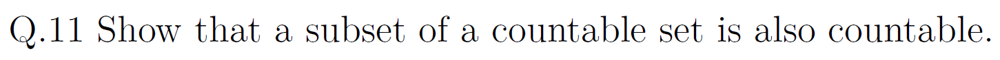

PF: 

Let $B$ is countable, and $A \subseteq B$. Then there exists an injection $h:B\to\mathbb N$. 

Then, let $i : A \hookrightarrow B$, i.e., $\forall a \in A, i(a) = a$.

Thus there exists an composed injection $h \circ i : A \to \mathbb N$, which means $A$ is also countable.

$\texttt{Q.E.D.}$.

## Q.12

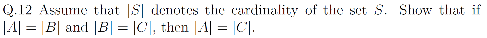

PF:

We have $|A|=|B|$ and $|B|=|C|$, then there exists bijections $f:A\to B$ and $g:B\to C$.
Thus for the composition $g\circ f:A\to C$:

Injectivity: If $(g\circ f)(a_1)=(g\circ f)(a_2)$, then by injectivity of $g$ we have $f(a_1)=f(a_2)$, and by injectivity of $f$ we get $a_1=a_2$.

Surjectivity: For any $c\in C$, we have $b\in B$ s.t. $g(b)=c$ by the surjectivity of $g$, then we have $a\in A$ s.t. $f(a)=b$ for the surjectivity of $f$. Therefore $(g\circ f)(a)=c$.

Hence $g\circ f$ is a bijection $A\to C$, i.e., $|A|=|C|$.

$\texttt{Q.E.D.}$.

## Q.13

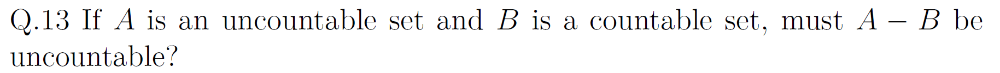

Sol: It **must be uncountable**.

Assuming that $A-B$ is countable. $A - B = A \cap \overline{B}$, then $A = (A\cap \overline{B})\cup(A\cap B) = (A-B)\cup(A\cap B)$.

For $A\cap B\subseteq B$ and $B$ is countable, $A\cap B$ is countable. And for the union of two countable sets is countable, $A$ is also countable, which leads to a contradiction.

Therefore, $A-B$ is uncountable.

## Q.14

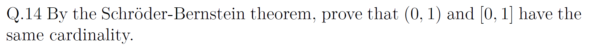

Schröder-Bernstein: If there is an injection $A\to B$ and an injection $B\to A$, then there exists a bijection $A\leftrightarrow B$.

Injections:
- $i:(0,1)\to[0,1]$, $i(x)=x$ (injection).
- $j:[0,1]\to(0,1)$, w.l.o.g., $j(x)=\frac{x+1}{3}$, for $j$ is strictly increasing, it's obviously an injection.

By Schröder-Bernstein, there exists a bijection $(0,1)\leftrightarrow[0,1]$, therefore $|(0,1)|=|[0,1]|$.

## Q.15

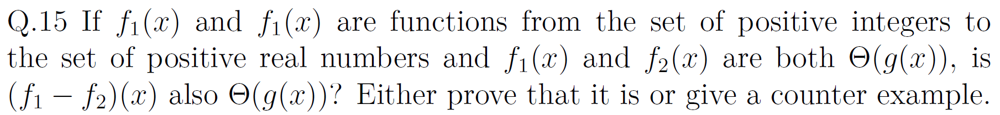

Sol: **No**.

Counterexample: Let $g(x)=f_1(x)=f_2(x)=x$. Then obviously $f_1,f_2 \in \Theta(g)$ but $(f_1-f_2)(x)\equiv 0$. 
Assuming that $0\in\Theta(g)$, then there exist $c_1, c_2>0$ and $N$ s.t. $c_1\cdot g(x) \le 0 \le c_2 \cdot g(x)$ for all $x\ge N$, which is obviously impossible, which leads to a contradiction.
Thus $(f_1-f_2)\notin\Theta(g)$.

## Q.16

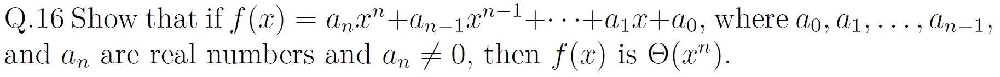

PF:

For $x\ge 1$, via triangle inequality: $|f(x)|\le (|a_n|+\cdots+|a_0|)\,x^n$. Thus let $c_2=|a_n|+\cdots+|a_0|$, we have $f(x)= O(x^n)$.

Plus, let $\alpha=|a_n|$ and $M=|a_{n-1}|+\cdots+|a_0|$. For $x\ge 1$, $|a_{n-1}x^{n-1}+\cdots+a_0|\le Mx^{n-1}$, thus, $|f(x)|\ge \alpha x^n-Mx^{n-1}=x^{n-1}(\alpha x-M)$.
Let $N=\max\{1,\lceil 2M/\alpha\rceil\}$. For $x\ge N$, $\alpha x-M\ge \tfrac{\alpha}{2}x$, so $|f(x)|\ge (\alpha/2)x^n$. Then let $c_1=\alpha/2$, we have $f(x) = \Omega(x^n)$.

Therefore, $f(x)=\Theta(x^n)$.

$\texttt{Q.E.D.}$.

ExtraPF:

Via Limit Test:

We have $\lim_{x\to\infty}\frac{|f(x)|}{x^n}=|a_n|\in(0,\infty)$. 
By the definition of limit, w.l.o.g., take $\varepsilon=|a_n|/2$, there exist $c_1,c_2>0$ and $N$ such that $c_1x^n\le |f(x)|\le c_2x^n$ for all $x\ge N$. Hence $f(x)=\Theta(x^n)$.

$\texttt{Q.E.D.}$.

## Q.17

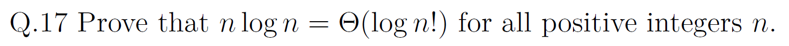

We have $n!\le n^n$, then $\log n!\le n\log n$.
Obviously we have $n!\ge (n/2)^{n/2}$, then $\log n!\ge \dfrac{n}{2}\log(\dfrac{n}{2}) = \dfrac{1}{2 \log 2}n \log n$.
Thus $\log n!=\Theta(n\log n)$.

$\texttt{Q.E.D.}$.

## Q.18

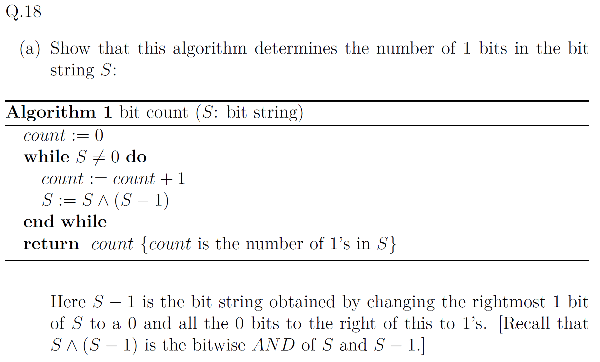

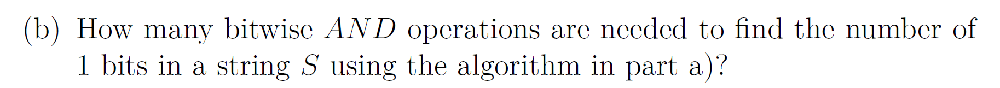

1. PF:

**Loop invariant**: After i-th iteration, count is $i$ and the current $S$ is the last $S$ with its rightmost 1-bit removed.

**Initialization**: At the begining, $i=0$, and the count is $0$, and it's trivially satisfied the loop invariant.

**Maintenance**: For $S - 1$, the rightmost 1-bit of $S$ will be removed, and all the 0-bits at the rightside of the 1-bit will become 1-bits. Then for the bitwise $AND$ operation, all the noticed bits will eventually become 0-bits. Which is to say, the rightmost 1-bit will be removed, which satisfy the loop invariant.

**Termination**: The loop will terminate when $S = 0$, i.e., there's no 1-bit in $S$, and the iterate times, which is the count, is the number of 1-bits.

$\texttt{Q.E.D.}$.

2. Sol:

In each iteration, there will be a bitwise $AND$ operation, and the rightmost 1-bit of $S$ will be removed. Thus the number of bitwise $AND$ operations equals to the number of **1-bits** in $S$.

## Q.19

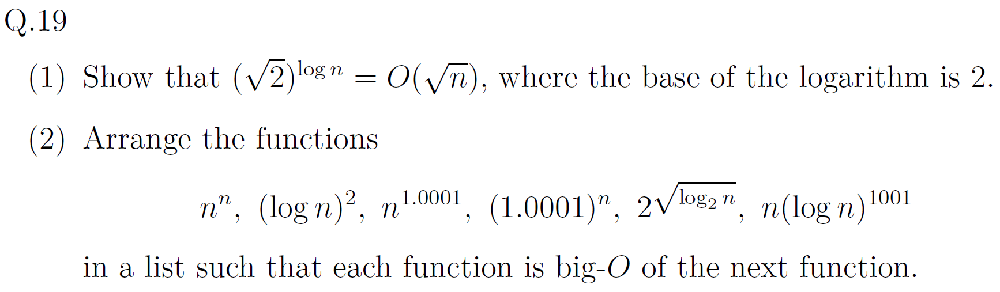

1. PF:

We have $a^{\log_b n}=n^{\log_b a}$, then $(\sqrt{2})^{\log_2 n}=n^{\log_2\sqrt{2}}=n^{1/2}=\sqrt{n}$, thus, $(\sqrt{2})^{\log n}=\Theta(\sqrt{n})$, then $(\sqrt{2})^{\log n} = O(\sqrt{n})$ is trivially true.

2. Sol:

$$
(\log n)^2 \prec 2^{\sqrt{\log_2 n}} \prec n(\log n)^{1001} \prec n^{1.0001} \prec (1.0001)^n \prec n^n
$$

## Q.20

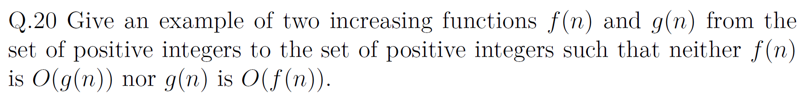

Sol:

Let $a_k=2^{2^k}$ and blocks $B_k=[a_k,a_{k+1})\cap\mathbb N$.
Let:
$$
f(n)=\begin{cases}
n^2,& n\in B_k,\ k\ is \ \text{even}\\
a_k n,& n\in B_k,\ k\ is \ \text{odd}
\end{cases}\quad
g(n)=\begin{cases}
a_k n,& n\in B_k,\ k\ is \ \text{even}\\
n^2,& n\in B_k,\ k\ is \ \text{odd}
\end{cases}
$$
Inside any block both $n^2$ and $a_k n$ increase in $n$. 

At boundaries, $f(a_{k+1}-1)<f(a_{k+1})=a_{k+1}^2$ and $g(a_{k+1}-1)<g(a_{k+1})=a_{k+1}^2$, then for $a_{k+1} \gg a_k$, $f,g$ are both increasing.

On even blocks, let $n=a_{k+1}-1$, $f(n)/g(n)=n/a_k\ge (a_{k+1}-1)/a_k\to\infty$, thus $f \neq O(g)$.

On odd blocks, let $n=a_{k+1}-1$, $g(n)/f(n)=n / a_k \ge (a_{k+1}-1)/a_k\to\infty$, thus $g \neq O(f)$.

Which satisfy the statement.

## Q.21

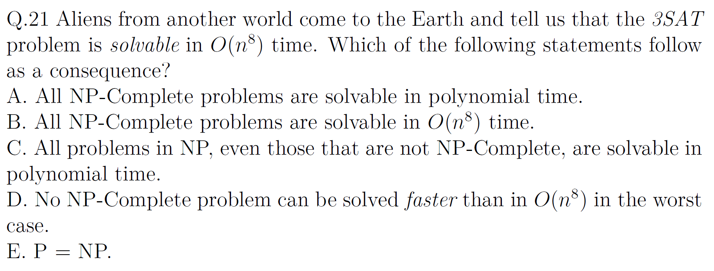

Sol:

A. **True.** Forall NP-Complete problem $X$, there is a poly-time reduction $X\le_p \text{3SAT}$. Compose it with the $O(n^8)$ 3SAT solver to get a polynomial-time algorithm for $X$.

B. **False**. The reduction may map size $n$ to $m=\text{poly}(n)$. Then the runtime becomes $O(m^8)=O(n^{8k})$ for some $k\ge1$, not necessarily $O(n^8)$.

C. **True**. If an NP-Complete problem (like 3SAT) is solvable in polynomial time, then $P=NP$, thus all problems in NP are solvable in polynomial time.

D. **False**. An $O(n^8)$ algorithm for 3SAT dosen't give the worst-case lower bound for other NP-Complete problems, then it might be faster.

E. **True**. 3SAT is NP-Complete and has a polynomial-time algorithm, we then have $P=NP$.

## Q.22

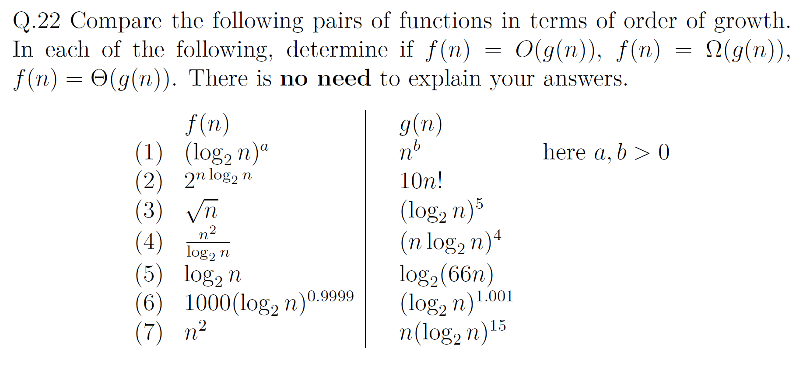

Sol:

1. $f(n) = O(g(n))$.
2. $f(n) = \Omega(g(n))$.
3. $f(n) = \Omega(g(n))$.
4. $f(n) = O(g(n))$.
5. $f(n) = \Theta(g(n))$.
6. $f(n) = O(g(n))$.
7. $f(n) = \Omega(g(n))$.