# Assignment III - Discrete Math(H)

**Name**: Yuxuan HOU (侯宇轩)

**Student ID**: 12413104

**Date**: 2025.11.09

## Q.1

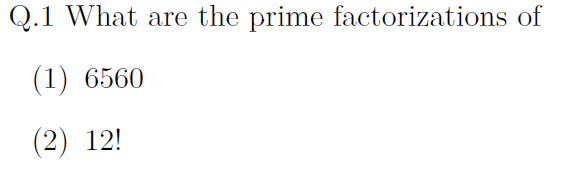

Sol:

1. $$
    6560 = 2^5 \times 5 \times 41
    $$

2. Implementing the Legendre's Formula:

    For base $2$: $\lfloor 12 / 2 \rfloor + \lfloor 12 / 4 \rfloor + \lfloor 12 / 8 \rfloor = 10$.

    For base 3: $\lfloor 12 / 3 \rfloor + \lfloor 12 / 9 \rfloor = 5$.

    For base 5: $\lfloor 12 / 5 \rfloor = 2$.

    For base 7: $\lfloor 12 / 7 \rfloor = 1$.

    For base 11: $\lfloor 12 / 11 \rfloor = 1$.

    Therefore, we have:
    $$
    12! = 2^{10} \times 3^5 \times 5^2 \times 7 \times 11
    $$

## Q.2

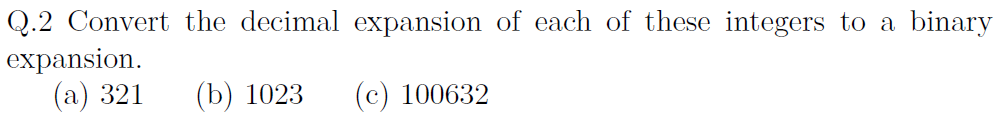

Sol:

1. We have $321 = 256 + 64 + 1 = 2^8 + 2^6 + 2^0 = (101000001)_2$.
2. We have $1023 = 1024 - 1 = 2^{10} - 2^0 = (1111111111)_2$.
3. With the regular method, we can calculate that $100632 = (11000100100011000)_2$.

## Q.3

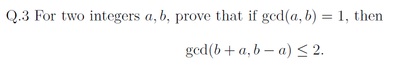

PF: 

Let $d = \gcd(b + a, b - a) = \gcd(b + a, b - a + (b + a)) = \gcd(b + a, 2b)$, then we have $d \mid 2b$.

Let $d = \gcd(b + a, b - a) = \gcd(b + a - (b - a), b - a) = \gcd(2a, b - a)$, then we have $d \mid 2a$.

For $\gcd(a, b) = 1$, $\gcd(2a, 2b) = 2\gcd(a, b) = 2$.

Therefore, $d \le 2$, i.e., $\gcd(b + a, b - a) \le 2$.

$\texttt{Q.E.D.}$.

## Q.4

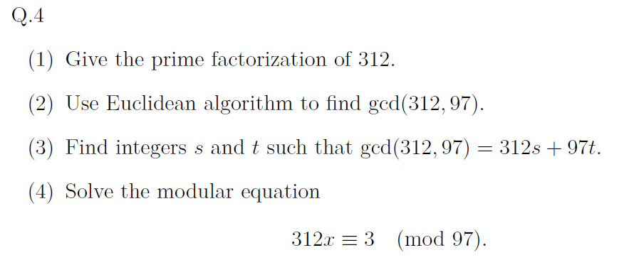

Sol:

1. We have $312 = 2^3 \times 3 \times 13$.

2. We have:

    $312 = 97 \times 3 + 21$.

    $97 = 21 \times 4 + 13$.

    $21 = 13 \times 1 + 8$.

    $13 = 8 \times 1 + 5$.

    $8 = 5 \times 1 + 3$.

    $5 = 3 \times 1 + 2$.

    $3 = 2 \times 1 + 1$.

    $2 = 1 \times 2 + 0$.

    Therefore, $\gcd(312, 97) = 1$.

3. Implement the back-substitute:

    $1 = 3 - 2 \times 1$.

    $1 = 3 - (5 - 3)$.

    $1 = 2 \times (8 - 5) - 5$.

    $1 = 2 \times 8 - 3 \times (13 - 8)$.

    $1 = 5 \times (21 - 13) - 3 \times 13$.

    $1 = 5 \times 21 - 8 \times (97 - 21 \times 4)$.

    $1 = 37 \times (312 - 97 \times 3) - 8 \times 97$.

    $1 = 37 \times 312 - 119 \times 97$.

    Therefore, $s = 37, t = -119$.

4. For $312 x \equiv 3 \pmod{97}$, and $312 \equiv 21 \pmod{97}$, we have: $21 x \equiv 3 \pmod{97}$.

    For (3), we have: $1 = 37 \times 21 - 8 \times 97$, then $37 \times 21 \equiv 1 \pmod{97}$, thus the inverse of $21$ is $37$, then $x \equiv 3 \times 37 \equiv 14 \pmod{97}$.

    Therefore, $x \equiv 14 \pmod{97}$.

## Q.5

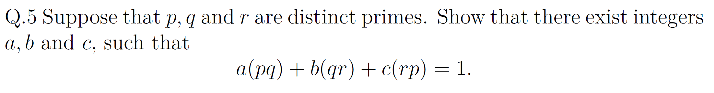

PF:

We have $$\gcd(pq,qr)=q$$ and $$\gcd(q,rp)=1$$, for Bezout, we have: $s(pq)+t(qr)=q, uq+v(rp)=1$.

Substitute the $q$ of the second equation via the first equation: $us(pq)+ut(qr)+v(rp)=1$.

W.l.o.g., let $a = us, b = ut, c = v$, it's obvious to prove.

$\texttt{Q.E.D.}$.

## Q.6

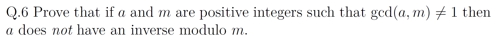

PF:
Let $$d=\gcd(a,m)\ne 1$$, we have $$d>1$$ and $$d\mid a$$ and $$d\mid m$$.
Assuming $$a$$ had an inverse, i.e., $$\exists x$$ s.t. $$ax\equiv 1\pmod m$$, i.e., $$m\mid (ax-1)$$.
For $$d\mid a$$ and $$d\mid m$$, then $$d\mid ax$$, and$$d\mid (ax-1)$$, then $d \mid (ax-1) - ax = -1$, i.e., $$d\mid 1$$, leading to a contradiction.

Thus, $$a$$ has no inverse mod $$m$$.

$\texttt{Q.E.D.}$.

## Q.7

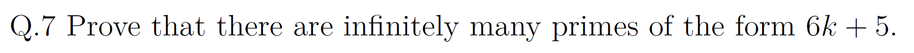

PF:

Assume that there are finitely many primes of the form $$6k+5$$, denotes as $$p_1, p_2, \cdots,p_n$$, let $$P=p_1\cdots p_n$$ and let $$N=6P-1$$.

Then $$N\equiv 5\pmod 6$$ and for each $$i$$ we have $$N\equiv -1\pmod{p_i}$$, thus $$p_i\nmid N$$.
Let $$q$$ be a prime divisor of $$N$$. Since $$q>3$$, obviously there has to be $$q\equiv 1$$ or $$q\equiv 5\pmod 6$$.
If all prime factors s.t. $$q\equiv 1\pmod 6$$, their product would s.t. $$\prod \equiv 1\pmod 6$$, leading to a contradiction to $$N\equiv 5\pmod 6$$.

Thus some factor satisfies $$q\equiv 5\pmod 6$$. Since $$q\nmid P$$, which is not in the prime list, producing a new $$6k+5$$ prime, leading to a contradiction.

Thus, there are infinitely many primes of the form $$6k+5$$.

$\texttt{Q.E.D.}$.

## Q.8

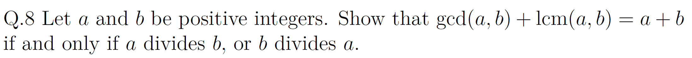

PF:

Let $$d=\gcd(a,b)$$ and let $$a=d\,x$$, $$b=d\,y$$ with $$\gcd(x,y)=1$$.
Then $$\operatorname{lcm}(a,b)=\dfrac{ab}{\gcd(a,b)}=dxy$$.
$$
\begin{aligned}&\gcd(a,b)+\operatorname{lcm}(a,b)=a+b\\
 \iff &d+dxy=dx+dy\\
 \iff &1+xy=x+y\\
 \iff &(x-1)(y-1)=0
 \end{aligned}
$$
And $$x=1$$ or $$y=1$$ is obviously represent $$a\mid b$$ or $$b\mid a$$.

$\texttt{Q.E.D.}$.

## Q.9

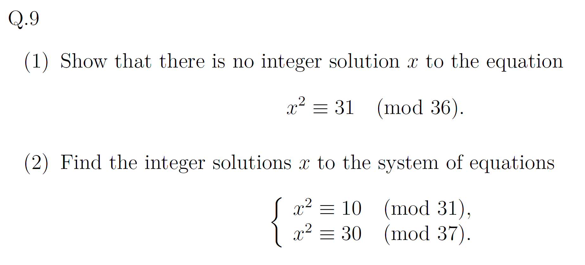

1. PF:

Since $$36$$ is divisible by $$4$$, any solution would also satisfy: $$x^2 \equiv 31 \equiv 3 \pmod{4}.$$
But squares modulo $$4$$ are only $$0$$ or $$1$$, leading to a contradiction.

Thus there is no integer solution.

$\texttt{Q.E.D.}$.

2. Sol:

For the first equation, the roots mod $$31$$ are $$x\equiv 14,17$$.

For the second equation, the roots mod $$37$$ are $$x\equiv 17, 20$$.

Combine them via CRT:

Let $$M=31\cdot 37=1147$$. Inverses:
$$37 \equiv 6 \pmod{31},\ 37^{-1}\equiv 26 \pmod{31}$$.
$$31 \equiv -6 \pmod{37},\ 31^{-1}\equiv 6 \pmod{37}.$$

Thus $c_1 = 37 \times 26,\ c_2 = 31 \times 6$.

- $$(14,17)\ \Rightarrow\ x\equiv 572 \pmod{1147},$$
- $$(17,17)\ \Rightarrow\ x\equiv 17 \pmod{1147},$$
- $$(14,20)\ \Rightarrow\ x\equiv 1130 \pmod{1147},$$
- $$(17,20)\ \Rightarrow\ x\equiv 575 \pmod{1147}.$$

Therefore, $$x \equiv 17,\ 572,\ 575,\ 1130 \pmod{1147}.$$

## Q.10

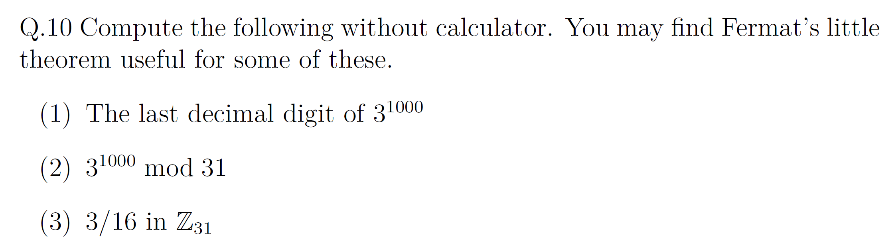

Sol:

1. The cycles $$3,9,7,1$$ with $$T = 4$$. Since $$1000\equiv 0\pmod 4$$, the last digit is $1$.

2. By Fermat’s little theorem, $$3^{30}\equiv 1\pmod{31}$$, and $$1000\equiv 10\pmod{30}$$, so $$3^{1000}\equiv 3^{10}\pmod{31}$$. And $3^{10}\equiv 25 \pmod{31}$.

   Thus $${3^{1000}\equiv 25\pmod{31}}$$.

3. Since $$16\cdot 2\equiv 1\pmod{31}$$, we have $$16^{-1}\equiv 2\pmod{31}$$, thus $3/16\equiv 3\cdot 16^{-1}\equiv 3\cdot 2\equiv 6\pmod{31}$.

## Q.11

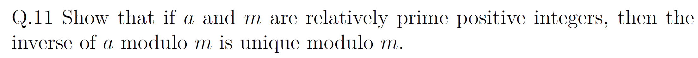

PF: 

Assume $$\gcd(a,m)=1$$ and $$x,$$ $$y$$ are both inverses of $$a$$ modulo $$m$$.

We have:
$$
 a(x-y) \equiv 0 \pmod m .
$$
Hence $$m\mid a(x-y)$$. Since $$\gcd(a,m)=1$$, we have $$m\mid(x-y)$$, i.e. $x \equiv y \pmod m$.

Thus the inverse of $$a$$ modulo $$m$$ is unique modulo $$m$$.

$\texttt{Q.E.D.}$.

## Q.12

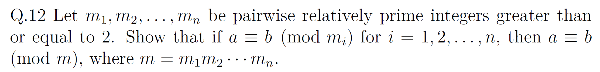

PF:

If $$\gcd(u,v)=1$$ and $$u\mid(a-b)$$, $$v\mid(a-b)$$, then obviously $$uv\mid(a-b)$$.
Thus for every $m_i$, they all s.t. $m_i \mid (a - b)$, and all the $m_i$ are relatively prime, thus their product $m$ also satisfy $m \mid (a - b)$, i.e., $a \equiv b \pmod{m}$.

$\texttt{Q.E.D.}$.

## Q.13

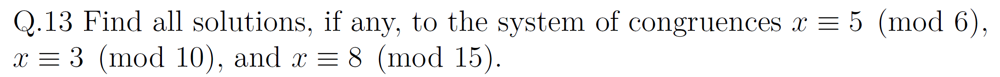

Sol: 

With the coprime-factor rule, we  have:
$$
\begin{aligned}
 x\equiv 5 \pmod 6 &\Rightarrow x\equiv 1 \pmod 2\ ,\ x\equiv 2 \pmod 3\\
 x\equiv 3 \pmod{10} &\Rightarrow x\equiv 1 \pmod 2\ ,\ x\equiv 3 \pmod 5\\
 x\equiv 8 \pmod{15} &\Rightarrow x\equiv 2 \pmod 3\ ,\ x\equiv 3 \pmod 5
 \end{aligned}
$$
Then Implement CRT:

$M = 30$.

$M_1=15, M_2=10, M_3=6$.

$M_1^{-1} = 1, M_2^{-1} = 1, M_3^{-1} = 1$.

Eventually, we have $x\equiv 23 \pmod{30}$.

Tips: Implementing exCRT can also solve this problem.

## Q.14

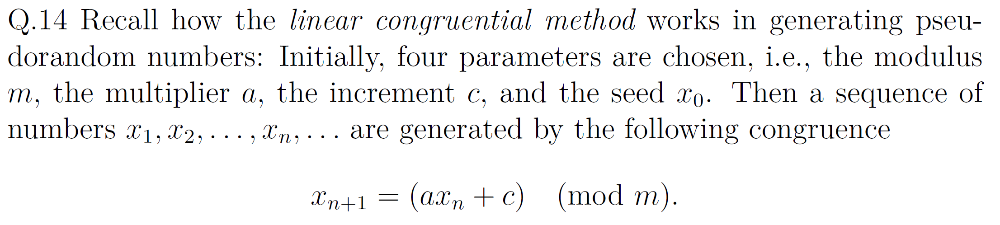

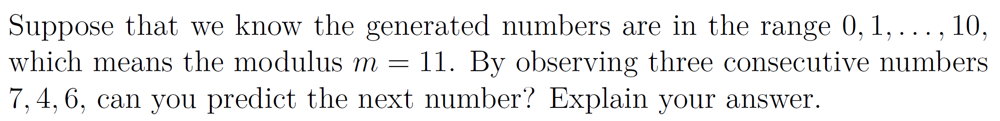

Sol:

From $$x_2\equiv ax_1+c \pmod{11}$$ and $$x_3\equiv ax_2+c \pmod{11}$$, subtract :
$$
x_3-x_2 \equiv a(x_2-x_1) \pmod{11}
$$
We have: $x_3-x_2=2, x_2-x_1=-3\equiv 8$, and $8^{-1}\equiv 7$.

Then,
$$
a \equiv 2\cdot 8^{-1} \equiv 2\cdot 7 \equiv 14 \equiv 3 \pmod{11}
$$
Thus, 
$$
c \equiv x_2-ax_1 \equiv 4-3\cdot 7 \equiv 4-21 \equiv -17 \equiv 5 \pmod{11}.
$$
Then,  $x_4 \equiv 3\cdot 6+5 \equiv 23 \equiv 1 \pmod{11}$.

## Q.15

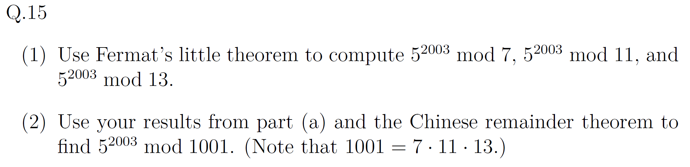

Sol: 

**Q15**

1. 

Since $5^{6} \equiv 1 \pmod{7}$:
$$
\begin{aligned}
5^{2003}&\equiv 5^{\,5}\equiv 3\pmod 7\\
\end{aligned}
$$

Since $5^{10} \equiv 1 \pmod{11}$:
$$
\begin{aligned}
5^{2003}&\equiv 5^{\,3}\equiv 4\pmod {11}\\
\end{aligned}
$$
Since $5^{12} \equiv 1 \pmod{13}$:
$$
\begin{aligned}
5^{2003}&\equiv 5^{\,11}\equiv 8\pmod {13}\\
\end{aligned}
$$

2. Implement CRT to modulus $$1001=7\cdot 11\cdot 13$$:

Let $$M=1001,\ M_1=143,\ M_2=91,\ M_3=77.$$
Inverses
$$
\begin{aligned}
M_1&\equiv 3\pmod 7\Rightarrow M_1^{-1}\equiv 5\pmod 7\\
M_2&\equiv 3\pmod{11}\Rightarrow M_2^{-1}\equiv 4\pmod{11}\\
M_3&\equiv -1\pmod{13}\Rightarrow M_3^{-1}\equiv 12\pmod{13}
\end{aligned}
$$
Set $$c_1=143\cdot 5=715,\ c_2=91\cdot 4=364,\ c_3=77\cdot 12=924.$$

Then
$$
\begin{aligned}
x
\equiv 3\cdot 715+4\cdot 364+8\cdot 924=10993\equiv 983\pmod{1001}
\end{aligned}
$$

Therefore, $${5^{2003}\equiv 983\pmod{1001}}$$.

## Q.16

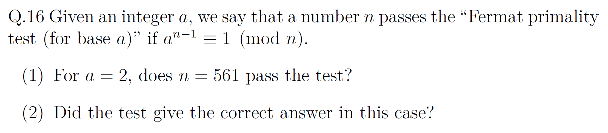

PF:

1. Factor $$561=3\cdot 11\cdot 17$$. Via Fermat’s little theorem:

$$
\begin{aligned}
2^{560}&=(2^{2})^{280}\equiv 1 \pmod 3\\
2^{560}&=(2^{10})^{56}\equiv 1 \pmod{11}\\
2^{560}&=(2^{16})^{35}\equiv 1 \pmod{17}
\end{aligned}
$$
By CRT, $$2^{560}\equiv 1 \pmod{561}$$. Hence $$561$$ passes the test.

2. No. For $$561$$ is composite: $$561=3\cdot 11\cdot 17$$. 

## Q.17

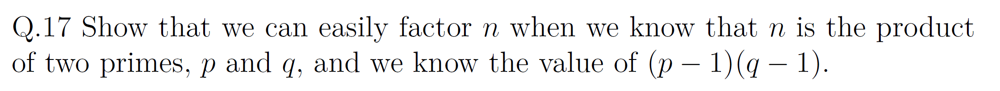

PF:

We know $$n=pq$$ and $$\varphi(n)=(p-1)(q-1)=n-(p+q)+1$$. 
Hence:
$$
s \,=\, p+q \,=\, n-\varphi(n)+1 .
$$
Then $$p$$ and $$q$$ solve
$$
X^{2}-sX+n=0 .
$$
$$
D \,=\, s^{2}-4n \,=\, (p+q)^{2}-4pq \,=\, (p-q)^{2}.
$$
Let $$r=\sqrt{D}$$:
$$
p=\frac{s+r}{2}\;\ \text{and}\;\ q=\frac{s-r}{2}.
$$
$\texttt{Q.E.D.}$.

## Q.18

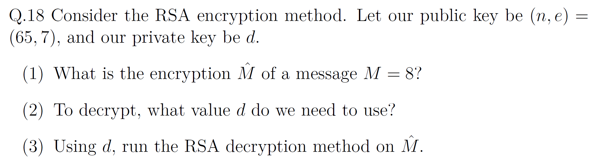

1. Encryption of $$M=8$$

$$
\widehat{M}\equiv M^{\,e}\pmod n\,,\quad \widehat{M}\equiv 8^{\,7}\pmod{65}
$$
Since $$8^{2}\equiv 64\equiv -1\pmod{65}$$
$$
8^{7}=8\,(8^{2})^{3}\equiv 8\,(-1)^{3}\equiv -8\equiv 57\pmod{65}
$$
Thus $$\widehat{M}=57$$.

2. Decryption exponent

$$
\varphi(65)=(5-1)(13-1)=48\,,\quad 7\,d\equiv 1\pmod{48}\,,\quad d=7
$$

3. Decrypt

$$
\widehat{M}^{\,d}\equiv 57^{\,7}\pmod{65}\,,
\quad 57\equiv -8\pmod{65}\,,\quad 8^{2}\equiv -1\pmod{65}\,
$$
$$
57^{\,7}\equiv (-8)^{7}\equiv -\,8^{7}\equiv -57\equiv 8\pmod{65}
$$
Result: $$M=8$$.

## Q.19

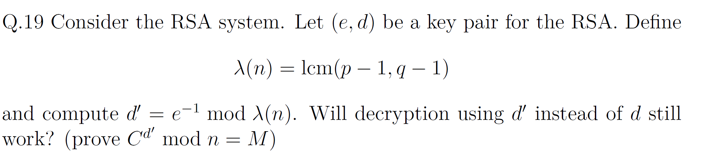

Let $$n=pq$$ with primes $$p\;\ q$$. Define $$\lambda(n)=\operatorname{lcm}(p-1\;\ q-1)$$ and choose $$d'$$ with $$e\,d'\equiv 1 \pmod{\lambda(n)}$$. 
For any message $$M$$ and ciphertext $$C\equiv M^{\,e}\pmod n$$ show $$C^{\,d'}\equiv M \pmod n$$.

Let $$e\,d'=1+k\,\lambda(n)$$. Prove modulo $$p$$ and modulo $$q$$.

- If $$p\mid M$$ then $$C\equiv 0\pmod p$$ hence $$C^{\,d'}\equiv 0\equiv M\pmod p$$.  
- If $$\gcd(M\;\ p)=1$$ then $$p-1\mid \lambda(n)$$ thus:
  $$
  M^{\,\lambda(n)}\equiv 1 \pmod p\\
  M^{\,e\,d'}=M^{\,1+k\,\lambda(n)}\equiv M\cdot\big(M^{\,\lambda(n)}\big)^{k}\equiv M \pmod p.
  $$

The same holds modulo $$q$$. Therefore $$C^{\,d'}\equiv M \pmod p$$ and $$C^{\,d'}\equiv M \pmod q$$. 
Via CRT we conclude $$C^{\,d'}\equiv M \pmod n$$. Thus decryption using $$d'$$ works.