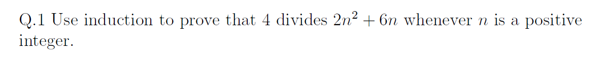
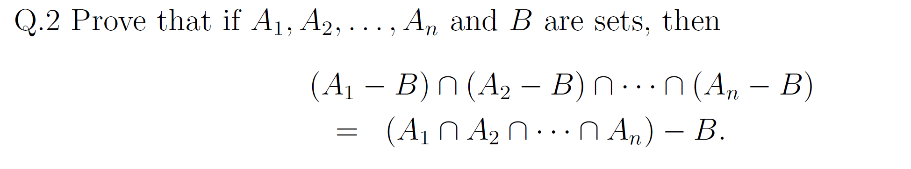
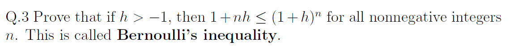
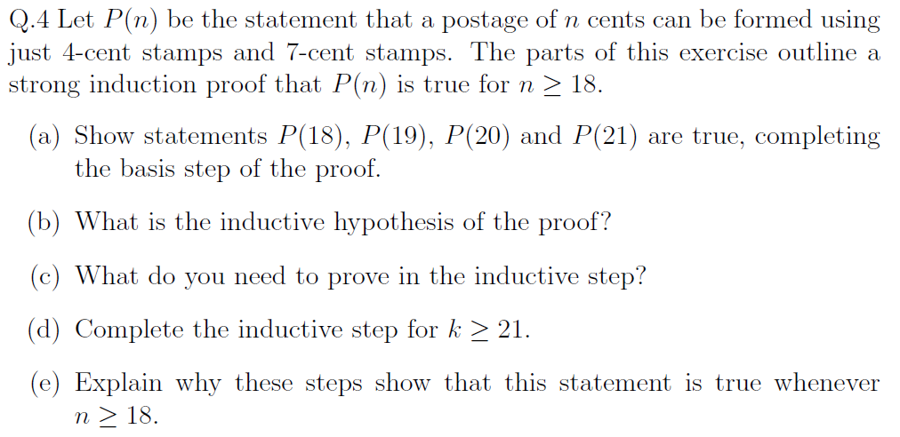
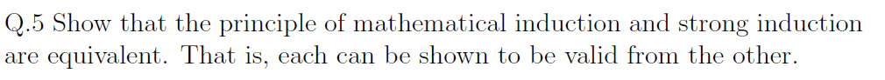

# Assignment IV - Discrete Math(H)

**Name**: Yuxuan HOU (侯宇轩)

**Student ID**: 12413104

**Date**: 2025.12.03

## Q.1

Base case: Let \(n=1\). Then
\[
2\cdot 1^2+6\cdot 1=2+6=8
\]
Then $4 \mid 8$.

Induction: Assume that for some positive integer \(k\),
\[
4\mid(2k^2+6k).
\]
Hence there exists an integer \(m\) such that
\[
2k^2+6k=4m.
\]

Inductive step:

\[
\begin{aligned}
2(k+1)^2+6(k+1)
&=2(k^2+2k+1)+6k+6 \\
&=2k^2+4k+2+6k+6 \\
&=2k^2+10k+8 \\
&=(2k^2+6k)+4k+8.
\end{aligned}
\]
We have \(2k^2+6k=4m\). Substituting, we obtain
\[
\begin{aligned}
2(k+1)^2+6(k+1)
&=4m+4k+8 \\
&=4m+4(k+2) \\
&=4(m+k+2).
\end{aligned}
\]
Therefore
\[
4\mid\bigl(2(k+1)^2+6(k+1)\bigr),
\]
Hence, for all positive integers \(n\), the integer \(2n^2+6n\) is divisible by \(4\).

## Q.2

Left side: For every \(i\), we have \(x\in A_i\), so
\[
x\in A_1\cap A_2\cap\cdots\cap A_n.
\]
At the same time, we also have \(x\notin B\). Hence
\[
x\in (A_1\cap A_2\cap\cdots\cap A_n) -  B.
\]
Therefore,
\[
(A_1- B)\cap\cdots\cap(A_n- B)
\subseteq
(A_1\cap\cdots\cap A_n)- B
\]

Right side:
\[
x\in A_1\cap A_2\cap\cdots\cap A_n
\quad\land\quad
x\notin B.
\]
 \(x\in A_1\cap A_2\cap\cdots\cap A_n\) is equivalent to for each \(i=1,\dots,n\), we have \(x\in A_i\).

Therefore, for every \(i\) we have \(x\in A_i\) and \(x\notin B\).

Hence,
\[
(A_1\cap\cdots\cap A_n)- B
\subseteq
(A_1- B)\cap\cdots\cap(A_n- B).
\]

Overall, we have:
$$
(A_1\cap\cdots\cap A_n)- B
=
(A_1- B)\cap\cdots\cap(A_n- B).
$$
$\texttt{Q.E.D.}$.

## Q.3

PF:

Base case: Let $n=0$. Then
$$
1+0\cdot h = 1 = (1+h)^0.
$$
So the inequality holds when $n=0$.

Induction: Assume that for some nonnegative integer $k$,
$$
1+kh \le (1+h)^k.
$$

Inductive step:

Since $h>-1$, we have $1+h>0$. Multiplying both sides of the induction hypothesis by $1+h$ (a positive number), we obtain
$$
(1+kh)(1+h) \le (1+h)^k(1+h) = (1+h)^{k+1}
$$

Now expand the left-hand side:
$$
\begin{aligned}
(1+kh)(1+h)
&= 1+h+kh+kh^2 \\
&= 1+(k+1)h+kh^2
\end{aligned}
$$

Because $k\ge 0$ and $h^2\ge 0$, we have $kh^2\ge 0$, so
$$
1+(k+1)h \le 1+(k+1)h+kh^2
$$
Then
$$
1+(k+1)h
\le 1+(k+1)h+kh^2
= (1+kh)(1+h)
\le (1+h)^{k+1}
$$
Therefore
$$
1+(k+1)h \le (1+h)^{k+1}
$$

Hence, for all nonnegative integers $n$,
$$
1+nh \le (1+h)^n
$$
$\texttt{Q.E.D.}$.

## Q.4

Sol:

1. Basis step:

For $18$ cents:
$$
18 = 4 + 7 + 7,
$$
so $P(18)$ holds.

For $19$ cents:
$$
19 = 4 + 4 + 4 + 7,
$$
so $P(19)$ holds.

For $20$ cents:
$$
20 = 4 + 4 + 4 + 4 + 4,
$$
so $P(20)$ holds.

For $21$ cents:
$$
21 = 7 + 7 + 7,
$$
so $P(21)$ holds.

Thus the basis step is complete.

---

2. Assume that for some integer $k\ge 21$, the statement $P(n)$ is true for every integer $n$ with

$$
18 \le n \le k.
$$

---

3. We need to prove that $P(k+1)$ is also true.

---

4. Let $k\ge 21$ and assume that $P(n)$ holds for all integers $n$ with $18\le n\le k$.

To show that $P(k+1)$ holds. Since $k\ge 21$, we have
$$
k+1 \ge 22
\quad\text{and hence}\quad
k+1-4 = k-3 \ge 18.
$$
By the inductive hypothesis, $P(k-3)$ is true, and we can add one more 4-cent stamp.

Therefore, a postage of $k+1$ cents can be formed using only 4-cent and 7-cent stamps, and thus $P(k+1)$ holds.

---

5. We have shown that:

    1. $P(18)$, $P(19)$, $P(20)$, and $P(21)$ are true.

    2. For any integer $k\ge 21$, if $P(n)$ is true for every integer $n$ with $18\le n\le k$, then $P(k+1)$ is also true.

By strong mathematical induction, it's easy to prove.

## Q.5

PF:

Assume the ordinary induction principle is valid.

Define
$$
Q(n) : P(1)\land P(2)\land \dots \land P(n).
$$

- Base case: $Q(1)$ is just $P(1)$.

- Induction step: assume $Q(k)$, i.e. $P(1),\dots,P(k)$ are all true.
  
  Then $P(k+1)$ is true, so
  $$
  Q(k+1)=Q(k)\land P(k+1)
  $$
  is true.

By ordinary induction on $Q(n)$ we get $Q(n)$ for all $n \ge 1$.

Hence each $P(n)$ is true, so the strong induction conclusion holds.

---

Assume the strong induction principle is valid.

- Base case: $P(1)$ is true by (O1).
- Strong step: assume $P(1),\dots,P(k)$ are all true. In particular, $P(k)$ is true, so we obtain $P(k+1)$.

Thus the hypotheses of strong induction are satisfied, and by strong induction $P(n)$ holds for all $n \ge 1$. This is exactly the conclusion of ordinary induction.

Therefore, ordinary induction and strong induction are equivalent.

$\texttt{Q.E.D.}$.

## Q.6

