# Assignment IV - Discrete Math(H)

**Name**: Yuxuan HOU (侯宇轩)

**Student ID**: 12413104

**Date**: 2025.12.07

## Q.1

Base case: Let \(n=1\). Then
\[
2\cdot 1^2+6\cdot 1=2+6=8
\]
Then $4 \mid 8$.

Induction: Assume that for some positive integer \(k\),
\[
4\mid(2k^2+6k).
\]
Hence there exists an integer \(m\) such that
\[
2k^2+6k=4m.
\]

Inductive step:

\[
\begin{aligned}
2(k+1)^2+6(k+1)
&=2(k^2+2k+1)+6k+6 \\
&=2k^2+4k+2+6k+6 \\
&=2k^2+10k+8 \\
&=(2k^2+6k)+4k+8.
\end{aligned}
\]
We have \(2k^2+6k=4m\). Substituting, we obtain
\[
\begin{aligned}
2(k+1)^2+6(k+1)
&=4m+4k+8 \\
&=4m+4(k+2) \\
&=4(m+k+2).
\end{aligned}
\]
Therefore
\[
4\mid\bigl(2(k+1)^2+6(k+1)\bigr),
\]
Hence, for all positive integers \(n\), the integer \(2n^2+6n\) is divisible by \(4\).

## Q.2

Left side: For every \(i\), we have \(x\in A_i\), so
\[
x\in A_1\cap A_2\cap\cdots\cap A_n.
\]
At the same time, we also have \(x\notin B\). Hence
\[
x\in (A_1\cap A_2\cap\cdots\cap A_n) -  B.
\]
Therefore,
\[
(A_1- B)\cap\cdots\cap(A_n- B)
\subseteq
(A_1\cap\cdots\cap A_n)- B
\]

Right side:
\[
x\in A_1\cap A_2\cap\cdots\cap A_n
\quad\land\quad
x\notin B.
\]
 \(x\in A_1\cap A_2\cap\cdots\cap A_n\) is equivalent to for each \(i=1,\dots,n\), we have \(x\in A_i\).

Therefore, for every \(i\) we have \(x\in A_i\) and \(x\notin B\).

Hence,
\[
(A_1\cap\cdots\cap A_n)- B
\subseteq
(A_1- B)\cap\cdots\cap(A_n- B).
\]

Overall, we have:
$$
(A_1\cap\cdots\cap A_n)- B
=
(A_1- B)\cap\cdots\cap(A_n- B).
$$
$\texttt{Q.E.D.}$.

## Q.3

PF:

Base case: Let $n=0$. Then
$$
1+0\cdot h = 1 = (1+h)^0.
$$
So the inequality holds when $n=0$.

Induction: Assume that for some nonnegative integer $k$,
$$
1+kh \le (1+h)^k.
$$

Inductive step:

Since $h>-1$, we have $1+h>0$. Multiplying both sides of the induction hypothesis by $1+h$ (a positive number), we obtain
$$
(1+kh)(1+h) \le (1+h)^k(1+h) = (1+h)^{k+1}
$$

Now expand the left-hand side:
$$
\begin{aligned}
(1+kh)(1+h)
&= 1+h+kh+kh^2 \\
&= 1+(k+1)h+kh^2
\end{aligned}
$$

Because $k\ge 0$ and $h^2\ge 0$, we have $kh^2\ge 0$, so
$$
1+(k+1)h \le 1+(k+1)h+kh^2
$$
Then
$$
1+(k+1)h
\le 1+(k+1)h+kh^2
= (1+kh)(1+h)
\le (1+h)^{k+1}
$$
Therefore
$$
1+(k+1)h \le (1+h)^{k+1}
$$

Hence, for all nonnegative integers $n$,
$$
1+nh \le (1+h)^n
$$
$\texttt{Q.E.D.}$.

## Q.4

Sol:

1. Basis step:

For $18$ cents:
$$
18 = 4 + 7 + 7,
$$
so $P(18)$ holds.

For $19$ cents:
$$
19 = 4 + 4 + 4 + 7,
$$
so $P(19)$ holds.

For $20$ cents:
$$
20 = 4 + 4 + 4 + 4 + 4,
$$
so $P(20)$ holds.

For $21$ cents:
$$
21 = 7 + 7 + 7,
$$
so $P(21)$ holds.

Thus the basis step is complete.

---

2. Assume that for some integer $k\ge 21$, the statement $P(n)$ is true for every integer $n$ with

$$
18 \le n \le k.
$$

---

3. We need to prove that $P(k+1)$ is also true.

---

4. Let $k\ge 21$ and assume that $P(n)$ holds for all integers $n$ with $18\le n\le k$.

To show that $P(k+1)$ holds. Since $k\ge 21$, we have
$$
k+1 \ge 22
\quad\text{and hence}\quad
k+1-4 = k-3 \ge 18.
$$
By the inductive hypothesis, $P(k-3)$ is true, and we can add one more 4-cent stamp.

Therefore, a postage of $k+1$ cents can be formed using only 4-cent and 7-cent stamps, and thus $P(k+1)$ holds.

---

5. We have shown that:

    1. $P(18)$, $P(19)$, $P(20)$, and $P(21)$ are true.

    2. For any integer $k\ge 21$, if $P(n)$ is true for every integer $n$ with $18\le n\le k$, then $P(k+1)$ is also true.

By strong mathematical induction, it's easy to prove.

## Q.5

PF:

Assume the ordinary induction principle is valid.

Define
$$
Q(n) : P(1)\land P(2)\land \dots \land P(n).
$$

- Base case: $Q(1)$ is just $P(1)$.

- Induction step: assume $Q(k)$, i.e. $P(1),\dots,P(k)$ are all true.
  
  Then $P(k+1)$ is true, so
  $$
  Q(k+1)=Q(k)\land P(k+1)
  $$
  is true.

By ordinary induction on $Q(n)$ we get $Q(n)$ for all $n \ge 1$.

Hence each $P(n)$ is true, so the strong induction conclusion holds.

---

Assume the strong induction principle is valid.

- Base case: $P(1)$ is true.
- Strong step: assume $P(1),\dots,P(k)$ are all true. In particular, $P(k)$ is true, so we obtain $P(k+1)$.

by strong induction $P(n)$ holds for all $n \ge 1$.

Therefore, ordinary induction and strong induction are equivalent.

$\texttt{Q.E.D.}$.

## Q.6

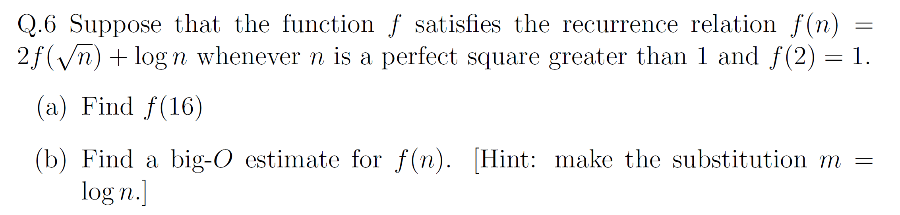

Sol:

1. 

$$
f(4) = 2f(2) + \log 4 = 2\cdot 1 + \log 4 = 2 + \log 4.
$$

$$
\begin{aligned}
f(16)
&= 2f(4) + \log 16 \\
&= 2(2 + \log 4) + \log 16 \\
&= 4 + 2\log 4 + \log 16.
\end{aligned}
$$

If $\log$ is base $2$, then $\log 4 = 2$ and $\log 16 = 4$, so
$$
f(16) = 4 + 2\cdot 2 + 4 = 12.
$$

---

2. 

Let $m = \log n$ and define
$$
g(m) = f(2^m).
$$
Then
$$
g(m) = 2g(m/2) + m, \qquad g(1) = 1.
$$

The recurrence
$$
T(m) = 2T(m/2) + m
$$
By the Master Theorem, we have:
$$
g(m) = \Theta(m\log m).
$$

Therefore
$$
f(n) = g(\log n) = \Theta\bigl((\log n)(\log\log n)\bigr),
$$
so
$$
f(n) = O\bigl((\log n)(\log\log n)\bigr).
$$

## Q.7

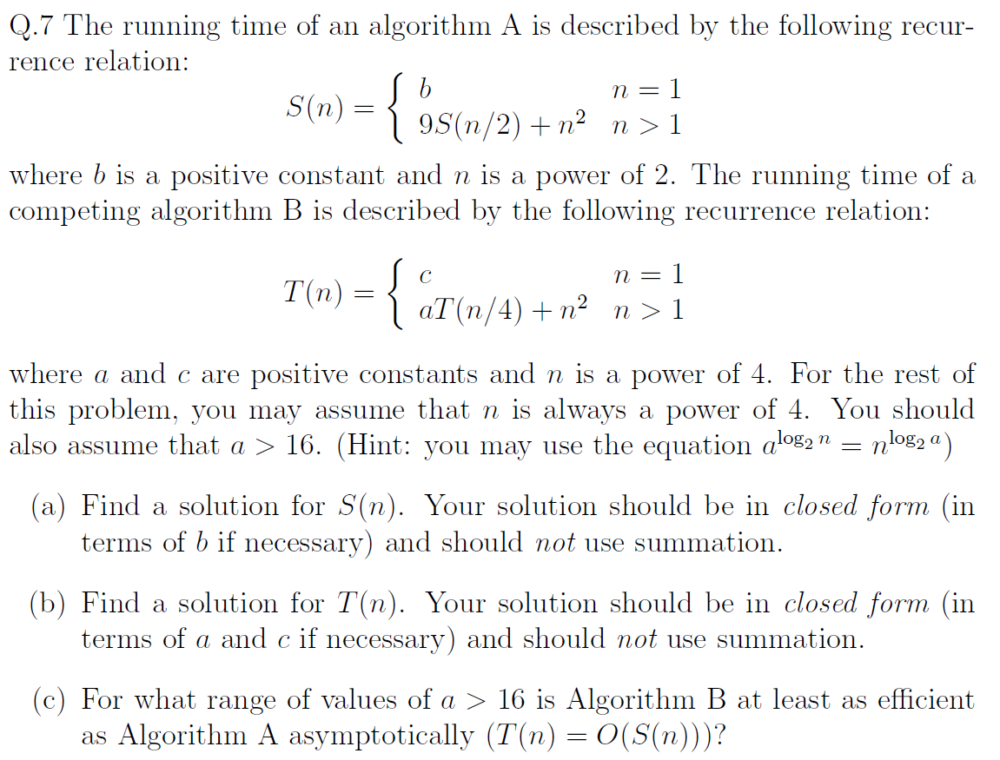

1. 

Let $n=2^k$ and define $u_k = S(2^k)$. Then
$$
u_0 = S(1)=b,\qquad
u_k = 9u_{k-1} + (2^k)^2 = 9u_{k-1} + 4^k.
$$
So
$$
u_k - 9u_{k-1} = 4^k.
$$
Homogeneous solution: $C9^k$.  Try a particular solution $A4^k$:
$$
A4^k - 9A4^{k-1}
= A4^{k-1}(4-9)
= 4^k
\Rightarrow A = -\frac45.
$$
Hence
$$
u_k = C9^k - \frac45\,4^k.
$$
Using $u_0=b$:
$$
b = C - \frac45 \Rightarrow C = b + \frac45.
$$
Since $n=2^k$ and $9^k = n^{\log_2 9}$, $4^k = n^2$, we get
$$
S(n) = \Bigl(b+\frac45\Bigr)n^{\log_2 9} - \frac45\,n^2
= \Theta\bigl(n^{\log_2 9}\bigr).
$$

---

2. 

Let $n=4^k$ and define $v_k = T(4^k)$. Then
$$
v_0 = T(1)=c,\qquad
v_k = av_{k-1} + (4^k)^2 = av_{k-1} + 16^k.
$$
So
$$
v_k - av_{k-1} = 16^k.
$$
Homogeneous solution: $Ca^k$.  Try a particular solution $B16^k$:
$$
B16^k - aB16^{k-1}
= B16^{k-1}(16-a)
= 16^k
\Rightarrow B = \frac{16}{16-a}\quad(a\ne16).
$$
Thus
$$
v_k = Ca^k + \frac{16}{16-a}16^k.
$$
Using $v_0=c$:
$$
c = C + \frac{16}{16-a}
\Rightarrow
C = c - \frac{16}{16-a}.
$$
Since $n=4^k$, we have $a^k = n^{\log_4 a}$ and $16^k = n^2$, so
$$
T(n)
= \Bigl(c - \frac{16}{16-a}\Bigr)n^{\log_4 a}
  + \frac{16}{16-a}n^2
= \Theta\bigl(n^{\log_4 a}\bigr)\quad(a>16).
$$

---

3. 

Asymptotically,
$$
S(n) = \Theta\bigl(n^{\log_2 9}\bigr),\qquad
T(n) = \Theta\bigl(n^{\log_4 a}\bigr).
$$
We have $T(n)=O(S(n))$ iff
$$
\log_4 a \le \log_2 9
\;\Longleftrightarrow\;
\frac12\log_2 a \le \log_2 9
\;\Longleftrightarrow\;
\log_2 a \le \log_2 81
\;\Longleftrightarrow\;
a \le 81.
$$
With the assumption $a>16$, Algorithm B is at least as efficient as
Algorithm A when
$$
16 < a \le 81.
$$

## Q.8

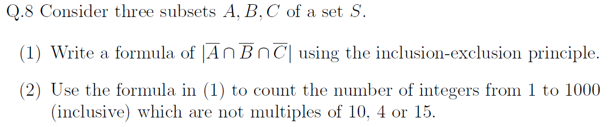

1. 

By De Morgan’s law,
$$
\overline A \cap \overline B \cap \overline C
= \overline{A \cup B \cup C}.
$$
Hence
$$
|\overline A \cap \overline B \cap \overline C|
= |S| - |A \cup B \cup C|.
$$
Using inclusion–exclusion for three sets,
$$
|A \cup B \cup C|
= |A| + |B| + |C|
  - |A \cap B| - |A \cap C| - |B \cap C|
  + |A \cap B \cap C|.
$$
So
$$
|\overline A \cap \overline B \cap \overline C|
= |S|
  -\Bigl(
    |A| + |B| + |C|
    - |A \cap B| - |A \cap C| - |B \cap C|
    + |A \cap B \cap C|
   \Bigr).
$$

---

2. 

Let $S = \{1,2,\dots,1000\}$, so $|S|=1000$.

Let
- $A$ be the multiples of $10$,
- $B$ be the multiples of $4$,
- $C$ be the multiples of $15$.

Then
$$
|A| = \left\lfloor \frac{1000}{10} \right\rfloor = 100,\quad
|B| = \left\lfloor \frac{1000}{4} \right\rfloor = 250,\quad
|C| = \left\lfloor \frac{1000}{15} \right\rfloor = 66.
$$

Intersections (using least common multiples):
$$
|A \cap B| = \left\lfloor \frac{1000}{20} \right\rfloor = 50,\quad
|A \cap C| = \left\lfloor \frac{1000}{30} \right\rfloor = 33,\quad
|B \cap C| = \left\lfloor \frac{1000}{60} \right\rfloor = 16,
$$
and
$$
|A \cap B \cap C|
= \left\lfloor \frac{1000}{60} \right\rfloor
= 16.
$$

Thus
$$
\begin{aligned}
|A \cup B \cup C|
&= 100 + 250 + 66 - 50 - 33 - 16 + 16 \\
&= 333.
\end{aligned}
$$

The required number is
$$
|\overline A \cap \overline B \cap \overline C|
= |S| - |A \cup B \cup C|
= 1000 - 333
= 667.
$$

So there are $667$ integers from $1$ to $1000$ (inclusive) that are not multiples of $10$, $4$, or $15$.

## Q.9

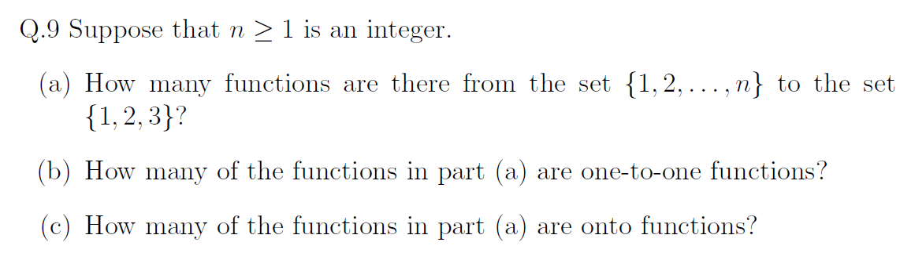

Sol:

1. 

The domain has $n$ elements and the codomain has $3$ elements. 

Each of the $n$ elements can be mapped independently to any of $3$ values,  so the total number of functions is $3^n$.

---

2. 

A function from $\{1,\dots,n\}$ to $\{1,2,3\}$ can be injective only if
$n \le 3$.

- If $n > 3$, there are no one-to-one functions (answer $0$).
- If $1 \le n \le 3$, an injective function corresponds to a permutation of $n$ distinct images chosen from $3$ elements:
$$
P(3,n) = \frac{3!}{(3-n)!}.
$$

---

3. 

A function can be onto only if $n \ge 3$.

- If $n < 3$, there are no onto functions (answer $0$).

Assume $n \ge 3$. The total number of functions is $3^n$. 

Use inclusion–exclusion to subtract those missing at least one value.

Let $A_i$ be the set of functions that never take the value $i$.

Then
- $|A_i| = 2^n$ for each $i$ (only two values allowed),
- $|A_i \cap A_j| = 1^n = 1$ for each pair $i \ne j$,
- $|A_1 \cap A_2 \cap A_3| = 0$.

Hence the number of non-onto functions is
$$
|A_1 \cup A_2 \cup A_3|
= 3\cdot 2^n - 3\cdot 1^n + 0
= 3\cdot 2^n - 3.
$$

Therefore the number of onto functions is
$$
3^n - (3\cdot 2^n - 3)
= 3^n - 3\cdot 2^n + 3
\qquad (n \ge 3).
$$

## Q.10

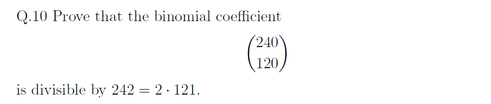

PF:
Write
$$
\binom{240}{120} = \frac{240!}{120!\,120!}.
$$
For a prime $p$, the exponent of $p$ in $n!$ is
$$
v_p(n!) = \left\lfloor\frac{n}{p}\right\rfloor
        + \left\lfloor\frac{n}{p^2}\right\rfloor
        + \left\lfloor\frac{n}{p^3}\right\rfloor + \cdots,
$$
so
$$
v_p\!\left(\binom{240}{120}\right)
= v_p(240!) - 2v_p(120!).
$$

Exponent of $11$:
\[
v_{11}(240!) =
\left\lfloor\frac{240}{11}\right\rfloor
+\left\lfloor\frac{240}{11^2}\right\rfloor
= 21 + 1 = 22,
\]
\[
v_{11}(120!) =
\left\lfloor\frac{120}{11}\right\rfloor
+\left\lfloor\frac{120}{11^2}\right\rfloor
= 10 + 0 = 10.
\]
Hence
\[
v_{11}\!\left(\binom{240}{120}\right)
= 22 - 2\cdot 10 = 2.
\]
Thus $\binom{240}{120}$ is divisible by $11^2=121$.

Exponent of $2$.:
\[
\begin{aligned}
v_2(240!) &=
\left\lfloor\frac{240}{2}\right\rfloor
+\left\lfloor\frac{240}{4}\right\rfloor
+\left\lfloor\frac{240}{8}\right\rfloor
+\left\lfloor\frac{240}{16}\right\rfloor
+\left\lfloor\frac{240}{32}\right\rfloor
+\left\lfloor\frac{240}{64}\right\rfloor
+\left\lfloor\frac{240}{128}\right\rfloor\\
&= 120+60+30+15+7+3+1 = 236,
\end{aligned}
\]
\[
v_2(120!) =
60+30+15+7+3+1 = 116.
\]
So
\[
v_2\!\left(\binom{240}{120}\right)
= 236 - 2\cdot 116 = 4.
\]
Hence $\binom{240}{120}$ is divisible by $2^4$, in particular by $2$.

Combining, $\binom{240}{120}$ is divisible by $2\cdot 11^2 = 242$, as required.

$\texttt{Q.E.D.}$.

## Q.11

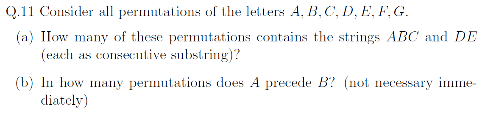

Sol:

1. Treat the block $ABC$ as one letter $[ABC]$ and the block $DE$ as another letter $[DE]$. Together with $F$ and $G$, we have four
   distinct objects:

$$
[ABC],\ [DE],\ F,\ G.
$$
Then:
$$
4! = 24
$$
Hence the number of permutations containing $ABC$ and $DE$ as consecutive substrings is $24$.

---

2. There are in total

$$
7! = 5040
$$
permutations of the seven letters.

For any permutation, if we swap the positions of $A$ and $B$, we obtain a different permutation. In each such pair, exactly one permutation has $A$ before $B$, and the other has $B$ before $A$. This gives a pairing of all permutations into two-element sets of this form.

Then the number is
$$
\frac{7!}{2} = 2520.
$$

## Q.12

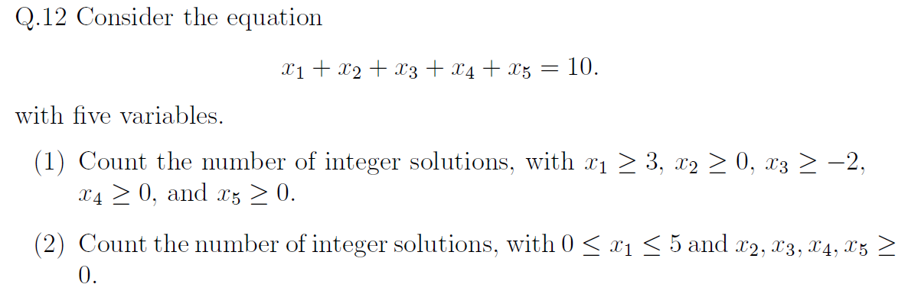

Sol:

1. 

Set
$$
y_1 = x_1 - 3,\quad
y_2 = x_2,\quad
y_3 = x_3 + 2,\quad
y_4 = x_4,\quad
y_5 = x_5.
$$
Then $y_i \ge 0$ and
$$
(y_1+3) + y_2 + (y_3-2) + y_4 + y_5 = 10
\iff
y_1 + y_2 + y_3 + y_4 + y_5 = 9.
$$
The number of nonnegative integer solutions of $y_1 + \cdots + y_5 = 9$ is, by stars and bars,
$$
\binom{9+5-1}{5-1} = \binom{13}{4} = 715.
$$
So the answer is $715$.

---

2. 

First count all nonnegative solutions (ignoring $x_1 \le 5$):
$$
\binom{10+5-1}{5-1} = \binom{14}{4}.
$$
Next subtract those with $x_1 \ge 6$. For such solutions let $z_1 = x_1 - 6 \ge 0$; then
$$
z_1 + x_2 + x_3 + x_4 + x_5 = 4,
$$
whose nonnegative solutions are
$$
\binom{4+5-1}{5-1} = \binom{8}{4}.
$$
Therefore the number of solutions with $0 \le x_1 \le 5$ is
$$
\binom{14}{4} - \binom{8}{4} = 931.
$$
## Q.13

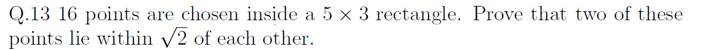

PF:

In any unit square, the farthest two points can be apart is the length of the diagonal:
$$
\sqrt{1^2+1^2} = \sqrt{2}.
$$
Thus any two points lying in the same unit square are at distance at most $\sqrt{2}$.

By the pigeonhole principle, at least one unit square contains at least two points. For that pair of points, their distance is at most $\sqrt{2}$.

Therefore among any 16 points in the $5\times 3$ rectangle, two of them lie within distance $\sqrt{2}$ of each other.

$\texttt{Q.E.D.}$

## Q.14

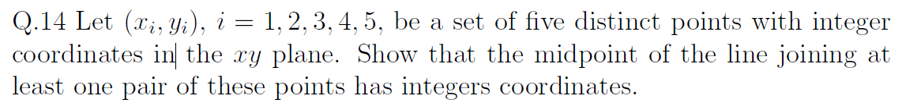

PF:

For each point $(x_i,y_i)$, consider the parity of its coordinates and record the pair
$$
(x_i \bmod 2,\; y_i \bmod 2).
$$
Each coordinate is either $0$ or $1$ modulo $2$, so there are only four possible types:
$$
(0,0),\ (0,1),\ (1,0),\ (1,1).
$$
With five points and only four types, the pigeonhole principle implies that two points, say $(x_i,y_i)$ and $(x_j,y_j)$ with $i\ne j$, have the same type. Thus
$$
x_i \equiv x_j \pmod 2,\qquad y_i \equiv y_j \pmod 2.
$$
Hence $x_i+x_j$ and $y_i+y_j$ are both even, so
$$
\frac{x_i+x_j}{2},\qquad \frac{y_i+y_j}{2}
$$
are integers.

Therefore the midpoint
$$
\left(\frac{x_i+x_j}{2},\frac{y_i+y_j}{2}\right)
$$
has integer coordinates.

$\texttt{Q.E.D.}$

## Q.15

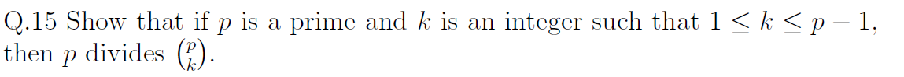

PF:

We have
$$
\binom{p}{k} = \frac{p!}{k!(p-k)!}.
$$
The factorial $p!$ contains the factor $p$ exactly once.

Since $1 \le k \le p-1$, both $k$ and $p-k$ are less than $p$, so all factors of $k!$ and $(p-k)!$ are $<p$; in particular,
$$
p \nmid k!, \qquad p \nmid (p-k)!,
$$
and therefore
$$
\gcd\bigl(p,\;k!(p-k)!\bigr)=1.
$$

Thus the factor $p$ in the numerator cannot be canceled with the denominator when the fraction is reduced. The reduced numerator still contains $p$, so $p$ divides $\binom{p}{k}$.

$\texttt{Q.E.D.}$

## Q.16

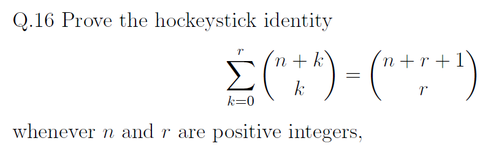

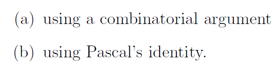

PF:

1. 

Using symmetry, $\binom{n+k}{k}=\binom{n+k}{n}$ and $\binom{n+r+1}{r}=\binom{n+r+1}{n+1}$, so we need to show
$$
\sum_{k=0}^r \binom{n+k}{n} = \binom{n+r+1}{n+1}.
$$
Interpret $\binom{n+r+1}{n+1}$ as the number of ways to choose $n+1$ elements from $\{1,2,\dots,n+r+1\}$. 

In any such choice, let $L$ be the largest chosen element. 

Then $L$ can be any of $n+1,n+2,\dots,n+r+1$. 

Write $L=n+k+1$ with $k=0,1,\dots,r$. 

Once $L$ is fixed, the remaining $n$ elements must be chosen from $\{1,\dots,n+k\}$, which can be done in $\binom{n+k}{n}$ ways. 

Different $k$ give disjoint families of choices, and together they account for all choices of $n+1$ elements. 

Hence
$$
\sum_{k=0}^r \binom{n+k}{n} = \binom{n+r+1}{n+1},
$$
which is equivalent to
$$
\sum_{k=0}^r \binom{n+k}{k} = \binom{n+r+1}{r}.
$$

---

2. 

Let
$$
S_r = \sum_{k=0}^r \binom{n+k}{k}.
$$
For $r=0$, we have $S_0=\binom{n}{0}=1=\binom{n+1}{0}$, so the identity holds. 

Assume for some $r-1\ge 0$ that
$$
S_{r-1} = \sum_{k=0}^{r-1} \binom{n+k}{k} = \binom{n+r}{r-1}.
$$
Then
$$
S_r = \sum_{k=0}^r \binom{n+k}{k}
    = S_{r-1} + \binom{n+r}{r}
    = \binom{n+r}{r-1} + \binom{n+r}{r}.
$$
By Pascal's identity $\binom{m}{t-1}+\binom{m}{t}=\binom{m+1}{t}$ with $m=n+r$ and $t=r$, we get
$$
\binom{n+r}{r-1} + \binom{n+r}{r} = \binom{n+r+1}{r}.
$$
Thus $S_r = \binom{n+r+1}{r}$, and by induction
$$
\sum_{k=0}^r \binom{n+k}{k} = \binom{n+r+1}{r}
$$
for all $r\ge 0$.

$\texttt{Q.E.D.}$

## Q.17

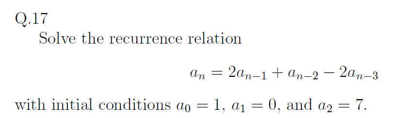

Sol:

Assume a solution of the form $a_n = r^n$. Substituting into $a_n = 2a_{n-1} + a_{n-2} - 2a_{n-3}$ gives the characteristic equation
$$
r^3 - 2r^2 - r + 2 = 0.
$$
Factoring,
$$
r^3 - 2r^2 - r + 2 = (r-1)(r-2)(r+1),
$$
so the roots are $1,2,-1$. Hence the general solution is
$$
a_n = A + B2^n + C(-1)^n.
$$
Use the initial conditions:

For $n=0$:
$$
1 = a_0 = A + B + C.
$$
For $n=1$:
$$
0 = a_1 = A + 2B - C.
$$
For $n=2$:
$$
7 = a_2 = A + 4B + C.
$$
Solving,
$$
B = 2,\quad C = \frac{3}{2},\quad A = -\frac{5}{2}.
$$
Therefore
$$
a_n = -\frac{5}{2} + 2\cdot 2^n + \frac{3}{2}(-1)^n
     = 2^{n+1} + \frac{3(-1)^n - 5}{2}.
$$

## Q.18

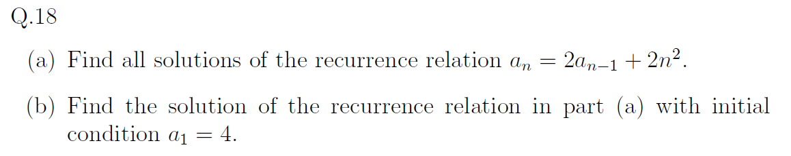

Sol:

1. The recurrence is
$$
a_n = 2a_{n-1} + 2n^2.
$$
The associated homogeneous recurrence $a_n^{(h)} = 2a_{n-1}^{(h)}$ has general solution
$$
a_n^{(h)} = C 2^n.
$$

For a particular solution, try $a_n^{(p)} = An^2 + Bn + D$. Then
$$
a_n^{(p)} - 2a_{n-1}^{(p)} = (-A-2)n^2 + (4A-B)n + (-2A+2B-D).
$$
Setting this equal to $2n^2$ gives
$$
-A-2 = 2,\quad 4A-B = 0,\quad -2A+2B-D = 0,
$$
so
$$
A = -2,\quad B = -8,\quad D = -12.
$$
Thus
$$
a_n^{(p)} = -2n^2 - 8n - 12.
$$

The general solution is
$$
a_n = C 2^n - 2n^2 - 8n - 12.
$$

---

2. Using $a_1 = 4$:
$$
4 = a_1 = C 2^1 - 2\cdot 1^2 - 8\cdot 1 - 12 = 2C - 22,
$$
so $2C = 26$ and $C = 13$. Therefore
$$
a_n = 13\cdot 2^n - 2n^2 - 8n - 12.
$$

## Q.19

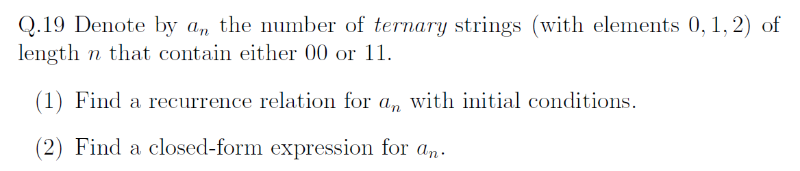

Sol:

1. Let $b_n$ be the number of ternary strings of length $n$ that avoid $00$ and $11$. Then $a_n = 3^n - b_n$.

   To find $b_n$, classify valid strings of length $n$ by their last symbol. Let $x_n,y_n,z_n$ be the numbers ending in $0,1,2$ respectively. From the allowed transitions,
   $$
   x_n = y_{n-1} + z_{n-1},\quad
   y_n = x_{n-1} + z_{n-1},\quad
   z_n = x_{n-1} + y_{n-1} + z_{n-1} = b_{n-1}.
   $$
   Since $b_n = x_n + y_n + z_n$ and $z_{n-1} = b_{n-2}$, we obtain
   $$
   b_n = 2b_{n-1} + b_{n-2}\quad(n\ge2),
   $$
   with $b_0=1$, $b_1=3$ (so $b_2=7$). Therefore
   $$
   a_n = 3^n - b_n,\quad
   a_1 = 0,\ a_2 = 2,
   $$
   and for $n\ge3$,
   $$
   a_n = 2a_{n-1} + a_{n-2} + 2\cdot 3^{n-2}.
   $$

---

2. For $b_n$ we solve $b_n = 2b_{n-1} + b_{n-2}$, $b_0=1$, $b_1=3$. The characteristic equation
   $$
   r^2 - 2r - 1 = 0
   $$
   has roots $r = 1\pm\sqrt{2}$. Thus
   $$
   b_n = \alpha(1+\sqrt2)^n + \beta(1-\sqrt2)^n.
   $$
   Using $b_0=1$, $b_1=3$ gives
   $$
   \alpha = \frac{\sqrt2+1}{2},\quad
   \beta = \frac{1-\sqrt2}{2},
   $$
   so
   $$
   b_n = \frac12(1+\sqrt2)^{n+1} + \frac12(1-\sqrt2)^{n+1}.
   $$
   Therefore
   $$
   a_n = 3^n - b_n
       = 3^n - \frac12\Bigl((1+\sqrt2)^{n+1} + (1-\sqrt2)^{n+1}\Bigr).
   $$

## Q.20

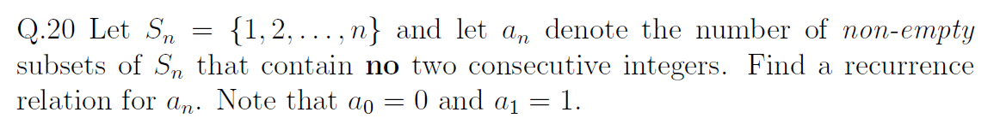

Sol:

Let $b_n$ be the number of subsets of $S_n$ containing no two consecutive integers, including the empty set. Then $b_n = a_n + 1$.

Divide the subsets counted by $b_n$ into two cases:

- If $n$ is not in the subset, we get any valid subset of $S_{n-1}$, giving $b_{n-1}$ subsets.
- If $n$ is in the subset, then $n-1$ cannot be, and removing $n$ leaves any valid subset of $S_{n-2}$, giving $b_{n-2}$ subsets.

Hence, for $n\ge2$,
$$
b_n = b_{n-1} + b_{n-2},
$$
with $b_0 = 1$ (only $\varnothing$) and $b_1 = 2$ ($\varnothing,\{1\}$).

Since $b_n = a_n + 1$, we have
$$
a_n + 1 = (a_{n-1}+1) + (a_{n-2}+1),
$$
so for $n\ge2$,
$$
a_n = a_{n-1} + a_{n-2} + 1,
$$
with initial conditions
$$
a_0 = 0,\qquad a_1 = 1.
$$

## Q.21

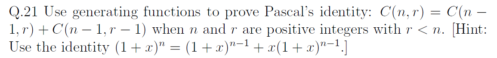

PF:

From the binomial theorem,
$$
(1+x)^n = \sum_{r=0}^n C(n,r)x^r.
$$
Using the hinted identity,
$$
(1+x)^n = (1+x)^{n-1} + x(1+x)^{n-1}.
$$
Expand the right-hand side:
$$
(1+x)^{n-1} = \sum_{r=0}^{n-1} C(n-1,r)x^r,
$$
$$
x(1+x)^{n-1} = x\sum_{r=0}^{n-1} C(n-1,r)x^r
             = \sum_{r=0}^{n-1} C(n-1,r)x^{r+1}
             = \sum_{r=1}^{n} C(n-1,r-1)x^{r}.
$$
Hence
$$
(1+x)^{n-1} + x(1+x)^{n-1}
= \sum_{r=0}^{n-1} C(n-1,r)x^r + \sum_{r=1}^{n} C(n-1,r-1)x^{r}.
$$
For $1\le r\le n-1$, the coefficient of $x^r$ on the right-hand side is
$$
C(n-1,r) + C(n-1,r-1).
$$
But on the left-hand side, $(1+x)^n$ has coefficient $C(n,r)$ at $x^r$.

Equating coefficients of $x^r$ for $1\le r\le n-1$ gives
$$
C(n,r) = C(n-1,r) + C(n-1,r-1),
$$
which is Pascal's identity.

$\texttt{Q.E.D.}$

## Q.22

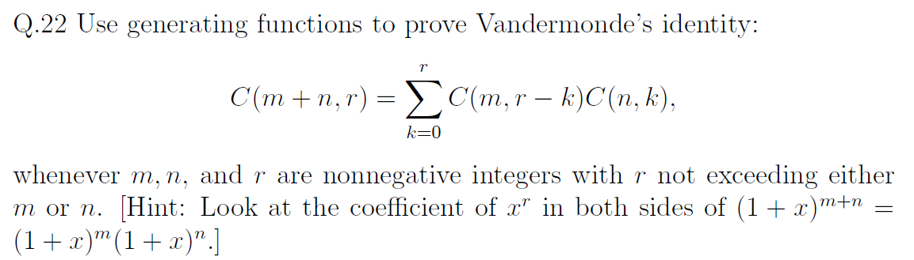

PF:

From the binomial theorem,
$$
(1+x)^{m+n} = \sum_{r=0}^{m+n} C(m+n,r)x^r.
$$
Also,
$$
(1+x)^{m+n} = (1+x)^m(1+x)^n.
$$
Expand each factor:
$$
(1+x)^m = \sum_{i=0}^m C(m,i)x^i,\qquad
(1+x)^n = \sum_{j=0}^n C(n,j)x^j.
$$
Their product is
$$
(1+x)^m(1+x)^n
= \left(\sum_{i=0}^m C(m,i)x^i\right)\left(\sum_{j=0}^n C(n,j)x^j\right).
$$
By the Cauchy product, the coefficient of $x^r$ in this product is
$$
\sum_{k=0}^r C(m,r-k)C(n,k).
$$
But in $(1+x)^{m+n}$ the coefficient of $x^r$ is $C(m+n,r)$. Equating the coefficients of $x^r$ on both sides gives
$$
C(m+n,r) = \sum_{k=0}^r C(m,r-k)C(n,k),
$$
which is Vandermonde's identity.

$\texttt{Q.E.D.}$

## Q.23

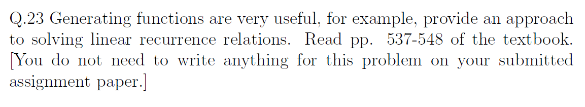

void.
