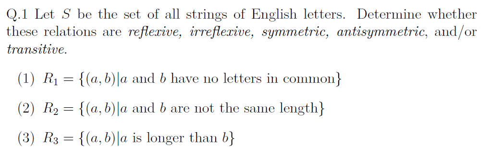
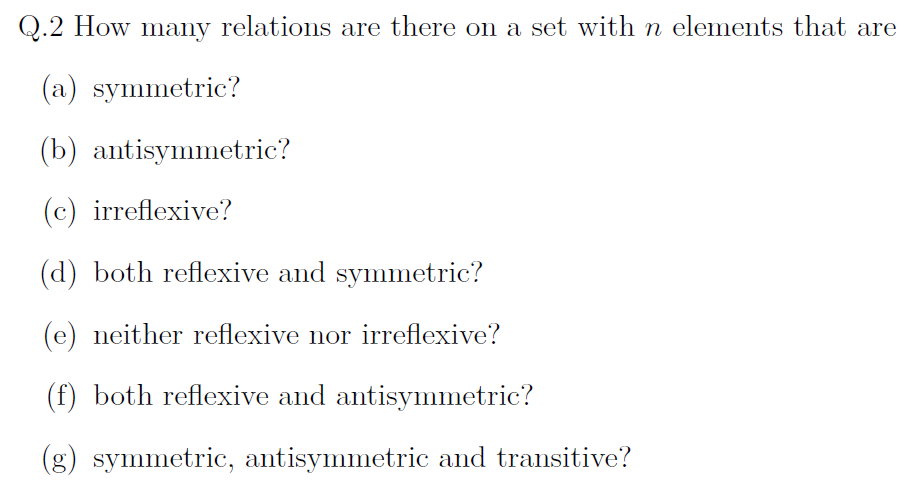
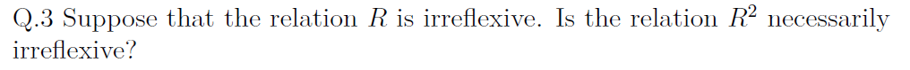
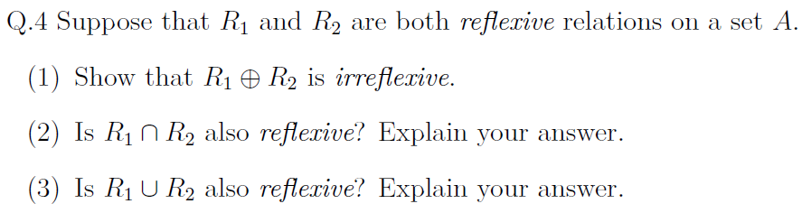
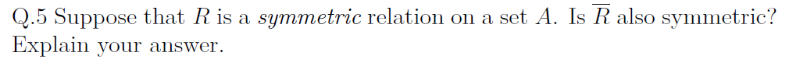
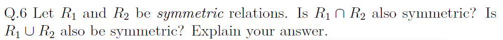

# Assignment V - Discrete Math(H)

**Name**: Yuxuan HOU (侯宇轩)

**Student ID**: 12413104

**Date**: 2025.12.18

## Q.1

Sol:

1. $R_1$: Not reflexive; not irreflexive (if the empty string is included); symmetric; not antisymmetric; not transitive (since it's not reflexive).
---
2. $R_2$: Not reflexive; irreflexive; symmetric; not antisymmetric; not transitive.
---
3. $R_3$: Not reflexive; irreflexive; not symmetric; antisymmetric; transitive.

## Q.2

Sol:

1. Symmetric: $2^{\binom{n}{2}}$ choices for unordered off-diagonal pairs and $2^n$ choices on the diagonal, so total $2^{\binom{n}{2}+n}=2^{n(n+1)/2}$.
---
2. Antisymmetric: for each unordered pair $\{i,j\}$ ($i<j$) there are 3 choices (one direction or neither), and diagonal is free, so total $3^{\binom{n}{2}}\cdot 2^n$.
---
3. Irreflexive: all $n$ diagonal pairs excluded, remaining $n(n-1)$ pairs free, so total $2^{n(n-1)}$.
---
4. Reflexive and symmetric: diagonal forced in, off-diagonal symmetric choices $2^{\binom{n}{2}}$, so total $2^{\binom{n}{2}}=2^{n(n-1)/2}$.
---
5. Neither reflexive nor irreflexive: diagonal subset must be nonempty and not all of it, giving $2^n-2$ choices; off-diagonal arbitrary $2^{n(n-1)}$, so total $(2^n-2)\cdot 2^{n(n-1)}$.
---
6. Reflexive and antisymmetric: diagonal forced in; off-diagonal has $3^{\binom{n}{2}}$ choices, so total $3^{\binom{n}{2}}$.
---
7. Symmetric, antisymmetric, and transitive: symmetry + antisymmetry forces all off-diagonal pairs absent, so any subset of the diagonal works; total $2^n$.

## Q.3

PF:

No. Counterexample: let $A=\{1,2\}$ and $R=\{(1,2),(2,1)\}$. Then $R$ is irreflexive since $(1,1),(2,2)\notin R$. But $(1,1)\in R^2$ because $(1,2)\in R$ and $(2,1)\in R$, and similarly $(2,2)\in R^2$. Hence $R^2$ is not necessarily irreflexive.
$\texttt{Q.E.D.}$

## Q.4

PF:

1. For any $a\in A$, reflexivity of $R_1$ and $R_2$ gives $(a,a)\in R_1$ and $(a,a)\in R_2$. Since $R_1\oplus R_2=(R_1\setminus R_2)\cup(R_2\setminus R_1)$ contains pairs in exactly one of the two relations, $(a,a)\notin R_1\oplus R_2$. Hence $R_1\oplus R_2$ is irreflexive.
---
2. Yes. For any $a\in A$, $(a,a)\in R_1$ and $(a,a)\in R_2$, so $(a,a)\in R_1\cap R_2$. Thus $R_1\cap R_2$ is reflexive.
---
3. Yes. For any $a\in A$, $(a,a)\in R_1$, so $(a,a)\in R_1\cup R_2$. Thus $R_1\cup R_2$ is reflexive.

$\texttt{Q.E.D.}$

## Q.5

PF:

Yes. Assume $(a,b)\in\overline{R}$, so $(a,b)\notin R$. If $(b,a)\in R$, then by symmetry of $R$ we would have $(a,b)\in R$, a contradiction. Hence $(b,a)\notin R$, so $(b,a)\in\overline{R}$. Therefore $\overline{R}$ is symmetric.

$\texttt{Q.E.D.}$

## Q.6

