# Assignment V - Discrete Math(H)

**Name**: Yuxuan HOU (侯宇轩)

**Student ID**: 12413104

**Date**: 2025.12.18

## Q.1

Sol:

1. $R_1$: Not reflexive; not irreflexive (if the empty string is included); symmetric; not antisymmetric; not transitive (since it's not reflexive).
---
2. $R_2$: Not reflexive; irreflexive; symmetric; not antisymmetric; not transitive.
---
3. $R_3$: Not reflexive; irreflexive; not symmetric; antisymmetric; transitive.

## Q.2

Sol:

1. Symmetric: $2^{\binom{n}{2}}$ choices for unordered off-diagonal pairs and $2^n$ choices on the diagonal, so total $2^{\binom{n}{2}+n}=2^{n(n+1)/2}$.
---
2. Antisymmetric: for each unordered pair $\{i,j\}$ ($i<j$) there are 3 choices (one direction or neither), and diagonal is free, so total $3^{\binom{n}{2}}\cdot 2^n$.
---
3. Irreflexive: all $n$ diagonal pairs excluded, remaining $n(n-1)$ pairs free, so total $2^{n(n-1)}$.
---
4. Reflexive and symmetric: diagonal forced in, off-diagonal symmetric choices $2^{\binom{n}{2}}$, so total $2^{\binom{n}{2}}=2^{n(n-1)/2}$.
---
5. Neither reflexive nor irreflexive: diagonal subset must be nonempty and not all of it, giving $2^n-2$ choices; off-diagonal arbitrary $2^{n(n-1)}$, so total $(2^n-2)\cdot 2^{n(n-1)}$.
---
6. Reflexive and antisymmetric: diagonal forced in; off-diagonal has $3^{\binom{n}{2}}$ choices, so total $3^{\binom{n}{2}}$.
---
7. Symmetric, antisymmetric, and transitive: symmetry + antisymmetry forces all off-diagonal pairs absent, so any subset of the diagonal works; total $2^n$.

## Q.3

PF:

No. Counterexample: let $A=\{1,2\}$ and $R=\{(1,2),(2,1)\}$. Then $R$ is irreflexive since $(1,1),(2,2)\notin R$. But $(1,1)\in R^2$ because $(1,2)\in R$ and $(2,1)\in R$, and similarly $(2,2)\in R^2$. Hence $R^2$ is not necessarily irreflexive.
$\texttt{Q.E.D.}$

## Q.4

PF:

1. For any $a\in A$, reflexivity of $R_1$ and $R_2$ gives $(a,a)\in R_1$ and $(a,a)\in R_2$. Since $R_1\oplus R_2=(R_1- R_2)\cup(R_2-R_1)$ contains pairs in exactly one of the two relations, $(a,a)\notin R_1\oplus R_2$. Hence $R_1\oplus R_2$ is irreflexive.
---
2. **Yes.** For any $a\in A$, $(a,a)\in R_1$ and $(a,a)\in R_2$, so $(a,a)\in R_1\cap R_2$. Thus $R_1\cap R_2$ is reflexive.
---
3. **Yes.** For any $a\in A$, $(a,a)\in R_1$, so $(a,a)\in R_1\cup R_2$. Thus $R_1\cup R_2$ is reflexive.

$\texttt{Q.E.D.}$

## Q.5

PF:

Yes. Assume $(a,b)\in\overline{R}$, so $(a,b)\notin R$. If $(b,a)\in R$, then by symmetry of $R$ we would have $(a,b)\in R$, a contradiction. Hence $(b,a)\notin R$, so $(b,a)\in\overline{R}$. Therefore $\overline{R}$ is symmetric.

$\texttt{Q.E.D.}$

## Q.6

PF:

1. Yes. If $(a,b)\in R_1\cap R_2$, then $(a,b)\in R_1$ and $(a,b)\in R_2$. Since both $R_1$ and $R_2$ are symmetric, $(b,a)\in R_1$ and $(b,a)\in R_2$, hence $(b,a)\in R_1\cap R_2$. So $R_1\cap R_2$ is symmetric.
---
2. Yes. If $(a,b)\in R_1\cup R_2$, then $(a,b)\in R_1$ or $(a,b)\in R_2$. By symmetry of the relation that contains $(a,b)$, we get $(b,a)$ in that same relation, hence $(b,a)\in R_1\cup R_2$. So $R_1\cup R_2$ is symmetric.

$\texttt{Q.E.D.}$

## Q.7

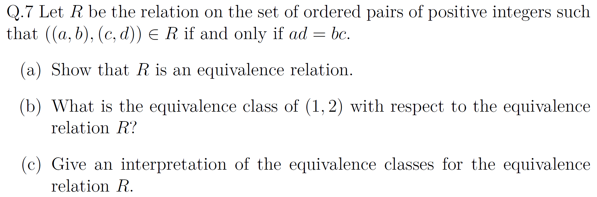

PF:

1. Reflexive: for any $(a,b)$, $ab=ba$, so $((a,b),(a,b))\in R$.

   Symmetric: if $ad=bc$ then $cb=da$, so $((c,d),(a,b))\in R$.

   Transitive: if $ad=bc$ and $cf=de$, then $adf=bcf$ and $bcf=bde$, hence $adf=bde$, so dividing by $d>0$ gives $af=be$, i.e., $((a,b),(e,f))\in R$.

   Thus $R$ is an equivalence relation.
---
2. $[(1,2)]=\{(c,d): 1\cdot d=2\cdot c\}=\{(c,2c): c\in\mathbb{Z}_{>0}\}$.
---
3. $((a,b),(c,d))\in R$ iff $ad=bc$, equivalently $a/b=c/d$.

   So each equivalence class is the set of all positive integer pairs representing the same rational number (same fraction/ratio).

$\texttt{Q.E.D.}$

## Q.8

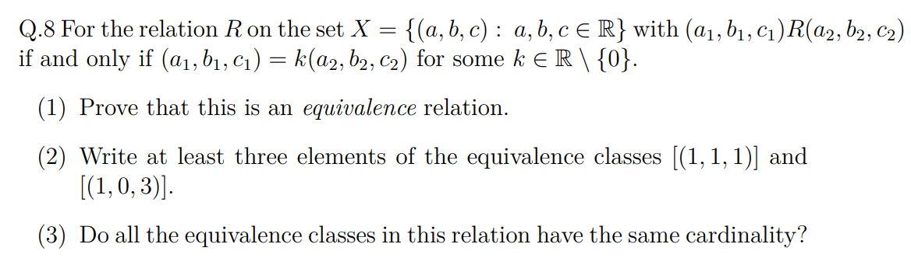

PF:

1. Reflexive: for any $(a,b,c)$, take $k=1\neq 0$, so $(a,b,c)=1(a,b,c)$ and $(a,b,c)R(a,b,c)$.

   Symmetric: if $(a_1,b_1,c_1)=k(a_2,b_2,c_2)$ with $k\neq 0$, then $(a_2,b_2,c_2)=(1/k)(a_1,b_1,c_1)$ and $1/k\neq 0$, so $(a_2,b_2,c_2)R(a_1,b_1,c_1)$.

   Transitive: if $(a_1,b_1,c_1)=k_1(a_2,b_2,c_2)$ and $(a_2,b_2,c_2)=k_2(a_3,b_3,c_3)$ with $k_1,k_2\neq 0$, then $(a_1,b_1,c_1)=k_1k_2(a_3,b_3,c_3)$ and $k_1k_2\neq 0$, so $(a_1,b_1,c_1)R(a_3,b_3,c_3)$.

   Hence $R$ is an equivalence relation.

   $\texttt{Q.E.D.}$
---
Sol:

2. $[(1,1,1)]=\{(k,k,k):k\in\mathbb{R}\setminus\{0\}\}$, e.g., $(2,2,2),(-1,-1,-1),(1/2,1/2,1/2)$. Also $[(1,0,3)]=\{(k,0,3k):k\in\mathbb{R}\setminus\{0\}\}$, e.g., $(2,0,6),(-1,0,-3),(1/2,0,3/2)$.

---
3. No. $[(0,0,0)]=\{(0,0,0)\}$ has cardinality $1$, while any $[(a,b,c)]$ with $(a,b,c)\neq(0,0,0)$ equals $\{k(a,b,c):k\in\mathbb{R}\setminus\{0\}\}$ and is uncountably infinite.

   So the equivalence classes do not all have the same cardinality.

## Q.9

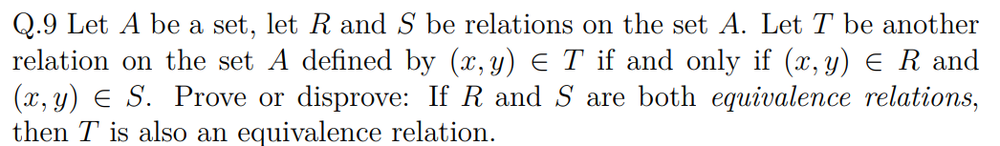

PF:

Let $T=R\cap S$.

Reflexive: for any $a\in A$, $(a,a)\in R$ and $(a,a)\in S$ (since both are reflexive), hence $(a,a)\in T$.

Symmetric: if $(a,b)\in T$, then $(a,b)\in R$ and $(a,b)\in S$. By symmetry of $R$ and $S$, $(b,a)\in R$ and $(b,a)\in S$, hence $(b,a)\in T$.

Transitive: if $(a,b)\in T$ and $(b,c)\in T$, then $(a,b),(b,c)\in R$ and $(a,b),(b,c)\in S$. By transitivity of $R$ and $S$, $(a,c)\in R$ and $(a,c)\in S$, hence $(a,c)\in T$.

Therefore $T$ is an equivalence relation.

$\texttt{Q.E.D.}$

## Q.10

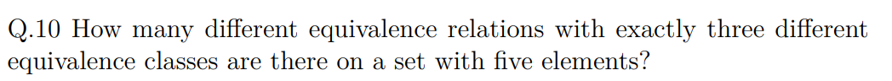

Sol:

Equivalence relations on a 5-element set correspond to partitions of the set. We count partitions into exactly 3 blocks. The only size patterns are $3+1+1$ and $2+2+1$.

For $3+1+1$: choose the 3-element block in $\binom{5}{3}=10$ ways.

For $2+2+1$: choose the singleton in $\binom{5}{1}=5$ ways, then split the remaining 4 elements into two unlabeled pairs in $3$ ways, giving $5\cdot 3=15$.

Total $10+15=25$.

## Q.11

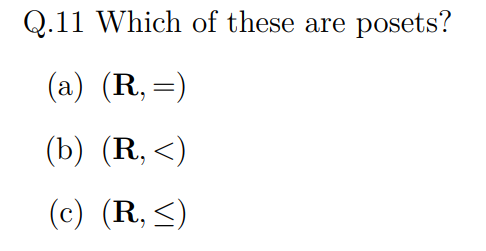

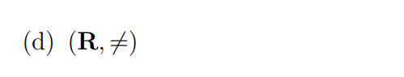

Sol:

1. $(\mathbb{R},=)$ is a poset (reflexive, antisymmetric, transitive).
---
2. $(\mathbb{R},<)$ is not a poset since it is not reflexive.
---
3. $(\mathbb{R},\le)$ is a poset (reflexive, antisymmetric, transitive).
---
4. $(\mathbb{R},\ne)$ is not a poset since it is not reflexive (and also not transitive).

## Q.12

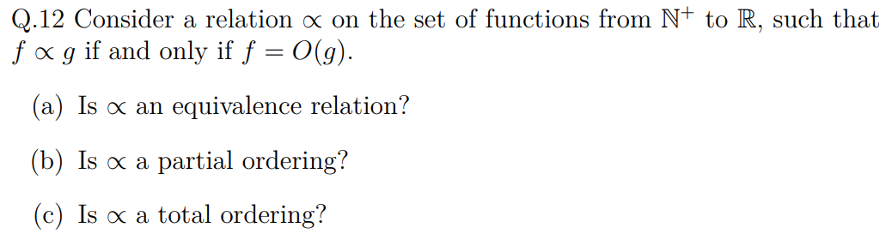

Sol:

1. Not an equivalence relation: symmetry fails. Example $f(n)=n$, $g(n)=n^2$. Then $f=O(g)$ but $g\not=O(f)$.
---
2. Not a partial order: antisymmetry fails. Example $f(n)=n$, $g(n)=2n$. Then $f=O(g)$ and $g=O(f)$ but $f\neq g$.
---
3. Not a total order, since a total order must be a partial order.

## Q.13

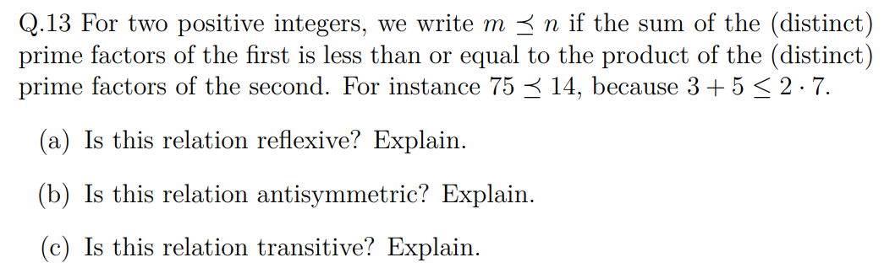

Sol:

1. Reflexive: yes. For every $m$, the sum of distinct prime factors of $m$ is $\le$ the product of the same distinct prime factors, so $m\preceq m$.
---
2. Antisymmetric: no. Example $m=2$, $n=4$. Then $2\preceq 4$ and $4\preceq 2$, but $2\neq 4$.
---
3. Transitive: no. Let $m=30030$, $n=2310$, $k=30$. Then $s(m)=41\le p(n)=2310$, so $m\preceq n$; also $s(n)=28\le p(k)=30$, so $n\preceq k$; but $s(m)=41\not\le p(k)=30$, so $m\not\preceq k$.

## Q.14

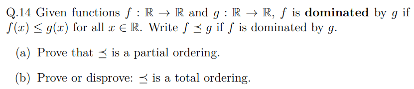

PF:

1. Reflexive: for any $f$, $f(x)\le f(x)$ for all $x$, so $f\preceq f$.
Antisymmetric: if $f\preceq g$ and $g\preceq f$, then $f(x)\le g(x)$ and $g(x)\le f(x)$ for all $x$, hence $f(x)=g(x)$ for all $x$ and $f=g$.
Transitive: if $f\preceq g$ and $g\preceq h$, then $f(x)\le g(x)\le h(x)$ for all $x$, so $f\preceq h$.
Thus $\preceq$ is a partial order.
---
2. Not a total order: take $f(x)=x$ and $g(x)=-x$. For $x>0$, $f(x)>g(x)$ so $f\not\preceq g$; for $x<0$, $g(x)>f(x)$ so $g\not\preceq f$. Hence they are incomparable, so the order is not total.

$\texttt{Q.E.D.}$

## Q.15

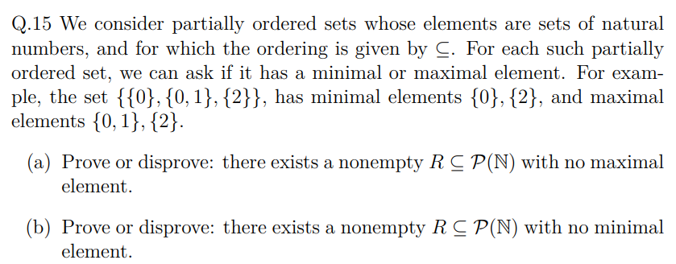

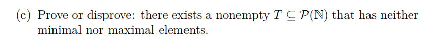

PF:

1. True. Let $R=\{\{0,1,\dots,n\}: n\in\mathbb{N}\}\subseteq\mathcal{P}(\mathbb{N})$. For each $A_n=\{0,1,\dots,n\}\in R$, we have $A_n\subsetneq A_{n+1}\in R$, so no element is maximal.
---
2. True. Let $S=\{\{n,n+1,n+2,\dots\}: n\in\mathbb{N}\}\subseteq\mathcal{P}(\mathbb{N})$. For each $B_n=\{n,n+1,\dots\}\in S$, we have $B_{n+1}\subsetneq B_n$ and $B_{n+1}\in S$, so no element is minimal.
---
3. True. Let $T=\{A\subseteq\mathbb{N}: A\text{ is infinite and }\mathbb{N}\setminus A\text{ is infinite}\}$. This $T$ is nonempty (e.g., the evens). For any $A\in T$, pick $a\in A$ and $b\in\mathbb{N}\setminus A$. Then $A\setminus\{a\}\in T$ and is a proper subset of $A$, and $A\cup\{b\}\in T$ and is a proper superset of $A$. Hence $T$ has neither minimal nor maximal elements.

$\texttt{Q.E.D.}$

## Q.16

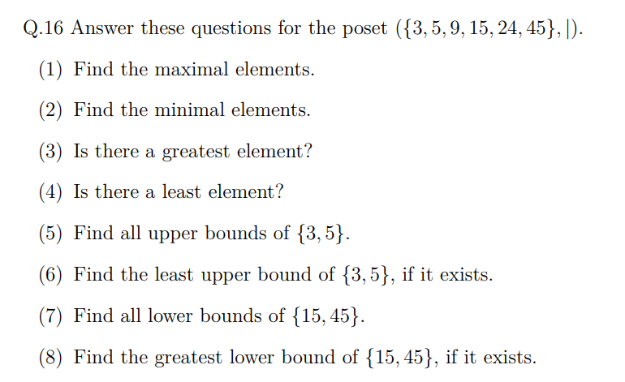

Sol:

1. Maximal elements: $\{24,45\}$.
---
2. Minimal elements: $\{3,5\}$.
---
3. No greatest element (e.g., $45\nmid 24$).
---
4. No least element (e.g., $3\nmid 5$ and $5\nmid 3$).
---
5. Upper bounds of $\{3,5\}$: $\{15,45\}$.
---
6. $\operatorname{lub}\{3,5\}=15$.
---
7. Lower bounds of $\{15,45\}$: $\{3,5,15\}$.
---
8. $\operatorname{glb}\{15,45\}=15$.

## Q.17

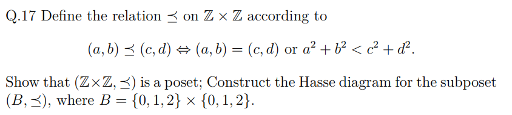

PF:

1. Define $r(a,b)=a^2+b^2$. Then $(a,b)\preceq(c,d)$ iff $(a,b)=(c,d)$ or $r(a,b)<r(c,d)$.
  Reflexive: $(a,b)=(a,b)$, so $(a,b)\preceq(a,b)$.
  Antisymmetric: if $x\preceq y$ and $y\preceq x$, they cannot both be strict (that would give $r(x)<r(y)$ and $r(y)<r(x)$), so $x=y$.
  Transitive: if $x\preceq y$ and $y\preceq z$, then either an equality occurs (giving $x\preceq z$ immediately) or $r(x)<r(y)<r(z)$, hence $r(x)<r(z)$ and $x\preceq z$.
  Thus $(\mathbb{Z}\times\mathbb{Z},\preceq)$ is a poset.

  $\texttt{Q.E.D.}$
---
Sol:

2. For $B=\{0,1,2\}\times\{0,1,2\}$, compute $r(a,b)$:
  Level $0$: $(0,0)$.
  Level $1$: $(0,1),(1,0)$.
  Level $2$: $(1,1)$.
  Level $4$: $(0,2),(2,0)$.
  Level $5$: $(1,2),(2,1)$.
  Level $8$: $(2,2)$.
  Covers occur only between adjacent levels $0\to1\to2\to4\to5\to8$, so the cover edges are:
  $(0,0)\prec(0,1),(1,0)$;
  $(0,1)\prec(1,1)$ and $(1,0)\prec(1,1)$;
  $(1,1)\prec(0,2),(2,0)$;
  $(0,2)\prec(1,2),(2,1)$ and $(2,0)\prec(1,2),(2,1)$;
  $(1,2)\prec(2,2)$ and $(2,1)\prec(2,2)$.

