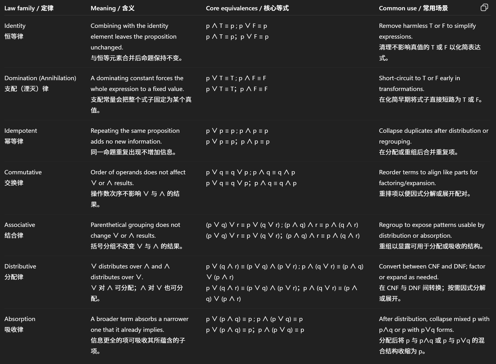
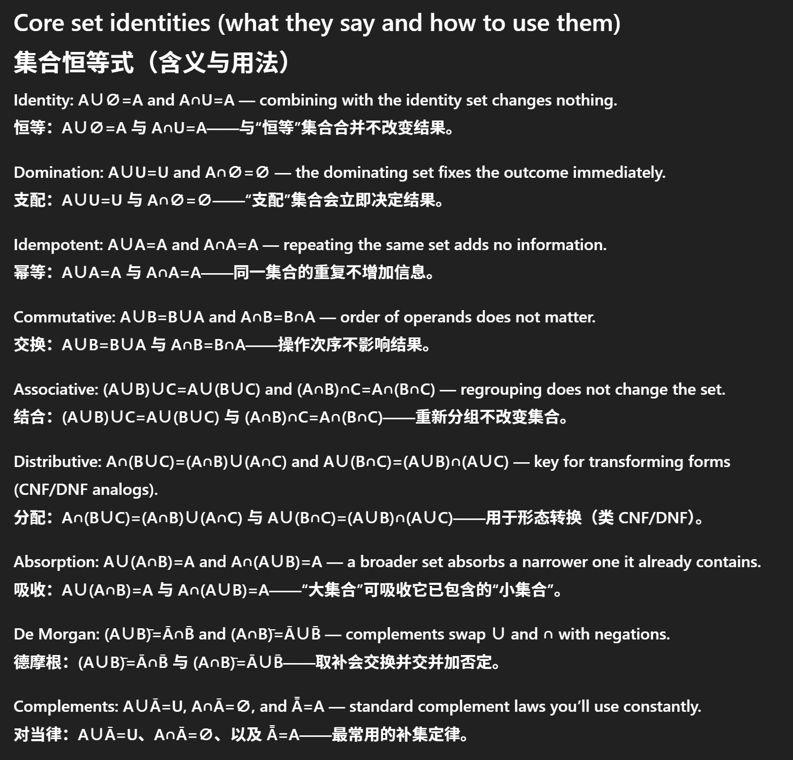
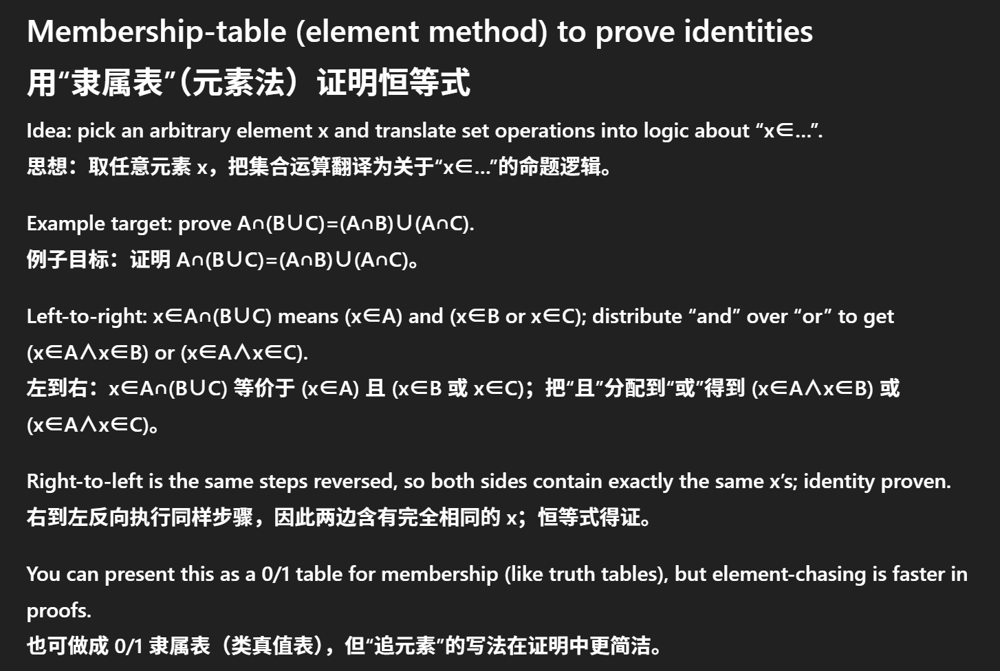
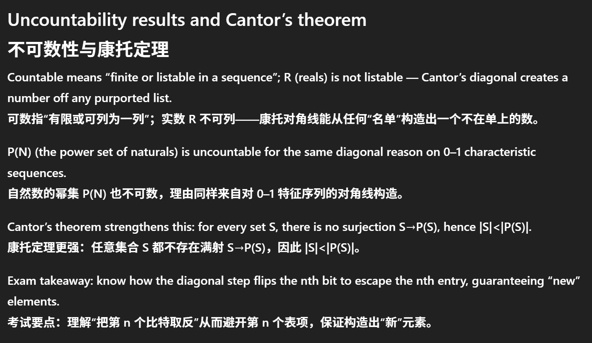
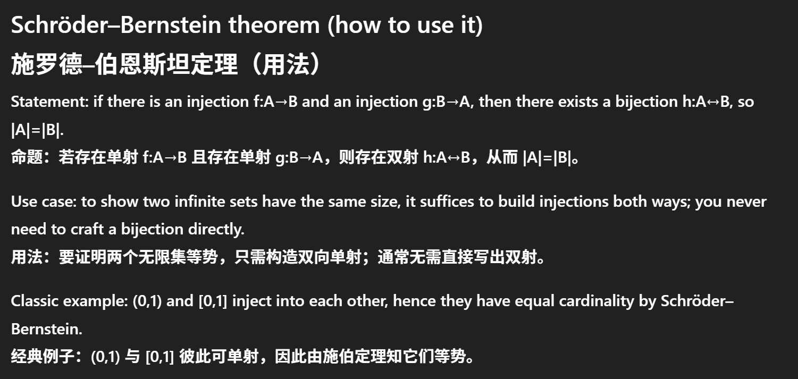

# DMH - Midterm Review

## Logic & Proof (30+%)

**contingency**: neither tautology nor contradiction

Operator precedence (typical): ¬ > ∧ > ∨ > → > ↔; use parentheses to avoid ambiguity.

- double negation ¬¬p ≡ p
- De Morgan ¬(p∧q)≡¬p∨¬q and ¬(p∨q)≡¬p∧¬q.
- Implication rewrite: p→q ≡ ¬p∨q; biconditional: p↔q ≡ (p∧q)∨(¬p∧¬q).

only S are P: $\forall x (P(x) \to S(x))$.

exactly one x that P: $\exists x (P(x) \land \forall y(P(y) \to y = x))$.

**Modus Ponens (MP): from p and p→q, infer q; idea: if p guarantees q and p holds, then q must hold.**
 **肯定前件（MP）：由 p 与 p→q 推出 q；直觉：若 p 保证 q 且 p 为真，则 q 必真。**

**Modus Tollens (MT): from p→q and ¬q, infer ¬p; idea: if p forces q but q is false, p cannot be true.**
 **否定后件（MT）：由 p→q 与 ¬q 推出 ¬p；直觉：若 p 会导致 q，但 q 不成立，则 p 也不能成立。**

**Hypothetical Syllogism (HS): from p→q and q→r, infer p→r; chaining implications.**
 **假言三段论（HS）：由 p→q 与 q→r 推出 p→r；即把蕴含链起来。**

**Disjunctive Syllogism (DS): from p∨q and ¬p, infer q (symmetrically from p∨q and ¬q infer p).**
 **析取三段论（DS）：由 p∨q 与 ¬p 推出 q（对称地，p∨q 与 ¬q 推出 p）。**

**Addition: from p, infer p∨q; intuition: once p is true, “p or q” is already true regardless of q.**
 **加法：由 p 推出 p∨q；直觉：p 一旦为真，“p 或 q”无论 q 如何都为真。**

**Simplification: from p∧q, infer p (or infer q); a true conjunction makes each conjunct true.**
 **化简：由 p∧q 推出 p（或推出 q）；合取为真则各分句为真。**

**Conjunction: from p and q, infer p∧q; if both hold, we may combine them.**
 **并合：由 p 与 q 推出 p∧q；两者皆真可合并为合取。**

**Resolution (∨/¬ tool): from (p∨r) and (¬p∨q), infer (r∨q); it “eliminates” p by combining clauses.**
 **归结（处理 ∨/¬）：由 (p∨r) 与 (¬p∨q) 推出 (r∨q)；通过合并子句“消去”命题 p。**

**Universal Instantiation (UI): from ∀x P(x), infer P(c) for any domain element c; c must be arbitrary, not special.**
 **全称特化（UI）：由 ∀x P(x) 推出任意域元素 c 的 P(c)；c 必须是“任意的”，不应是特殊情形。**

(Fix: **Great question — the short answer is: UI truly allows any $c$, even a “special” one, but the “arbitrary $c$” warning is about when you later try to generalize to $\forall x$.**
 **问得非常好——简短回答是：全称特化确实允许任意 $c$，即使是“特殊”的；但“$c$ 必须任意”的提醒是为了防止你之后做 $\forall x$ 的概化时犯错。**)

**Universal Generalization (UG): from P(c) proven for an arbitrary c (with no special assumptions), infer ∀x P(x).**
 **全称概化（UG）：若对任意 c（且不依赖特殊假设）证明了 P(c)，可推出 ∀x P(x)。**

**Existential Instantiation (EI): from ∃x P(x), introduce a fresh constant k and assert P(k); k must be new and generic.**
 **存在特化（EI）：由 ∃x P(x) 新引入常元 k 并断言 P(k)；k 必须是新符号且不带特殊性。**

**Existential Generalization (EG): from P(c), infer ∃x P(x); this direction is always safe.**
 **存在概化（EG）：由 P(c) 推出 ∃x P(x)；此方向总是安全的。**

### Proof planning with rules

**Step 1 — Normalize: eliminate → and ↔, push ¬ inward (De Morgan), and lightly tidy with identity/absorption.**
 **第1步—规范化：消去 → 与 ↔，用德摩根内推 ¬，再用恒等/吸收等轻度整理。**

**Step 2 — Quantifiers: perform UI/EI to ground statements; keep side conditions for UG/EI straight.**
 **第2步—量词：先做 UI/EI 让命题“落地”；严格遵守 UG/EI 的前提条件。**

**Step 3 — Chain inferences: apply MP/MT/HS/DS or resolution; label each line with the exact rule used.**
 **第3步—串联推理：使用 MP/MT/HS/DS 或归结；每行标注所用的具体规则名称。**

**Step 4 — Close the goal: for existence, end with EG; for universals, ensure your witness was arbitrary before UG.**
 **第4步—收束目标：存在性用 EG 收尾；全称命题在 UG 前确认见证是任意而非特殊。**

**Tactical hint: when stuck, test a tiny truth-table scenario or try converting to CNF and use resolution.**
 **战术提示：卡住时可用小规模真值表试探，或转为 CNF 用归结。**

Examples:
$$
\forall x\,(Bird(x)\to Animal(x)) \quad \text{Premise}
$$
$$
Bird(tweety) \quad \text{Premise}
$$
$$
Bird(tweety)\to Animal(tweety) \quad \text{UI}
$$
$$
Animal(tweety) \quad \text{MP}
$$

$$
\text{Let } c \text{ be arbitrary}
$$
$$
P(c)\to P(c) \quad \text{Tautology}
$$
$$
\forall x\,(P(x)\to P(x)) \quad \text{UG}
$$

$$
\forall x\,(H(x)\to M(x)) \quad \text{Premise}
$$
$$
\exists x\,H(x) \quad \text{Premise}
$$
$$
H(k) \quad \text{EI with fresh } k
$$
$$
H(k)\to M(k) \quad \text{UI}
$$
$$
M(k) \quad \text{MP}
$$
$$
\exists x\,M(x) \quad \text{EG}
$$

$$
\forall x\,(P(x)\to Q(x)) \quad \text{Premise}
$$
$$
\forall x\,(Q(x)\to R(x)) \quad \text{Premise}
$$
$$
\text{Let } c \text{ be arbitrary}
$$
$$
P(c)\to Q(c) \quad \text{UI}
$$
$$
Q(c)\to R(c) \quad \text{UI}
$$
$$
P(c)\to R(c) \quad \text{HS}
$$
$$
\forall x\,(P(x)\to R(x)) \quad \text{UG}
$$

## Set & Function

**Bijective iff both injective and surjective; only bijections have inverses f⁻¹:B→A with f∘f⁻¹=I_B and f⁻¹∘f=I_A.** 
 **双射当且仅当既单又满；仅双射可定义逆函数 f⁻¹:B→A，且 f∘f⁻¹=I_B、f⁻¹∘f=I_A。**

**On finite sets with |A|=|B|=n, injective ⇔ surjective (so either implies bijective).** 
 **在有限集 |A|=|B|=n 的情形，单射 ⇔ 满射（任一者即双射）。**

Russell’s paradox: 

**Naive set comprehension says “for any property P, the set R={x | not x∈x} exists,” but then asking “is R∈R?” creates a contradiction.**
 **朴素的集合构造法说“对任意性质 P，集合 R={x | x∉x} 存在”，但当我们问“R∈R 吗？”就会产生矛盾。**

Notice RSA needs mod $\phi(n) = (p - 1)(q - 1)$